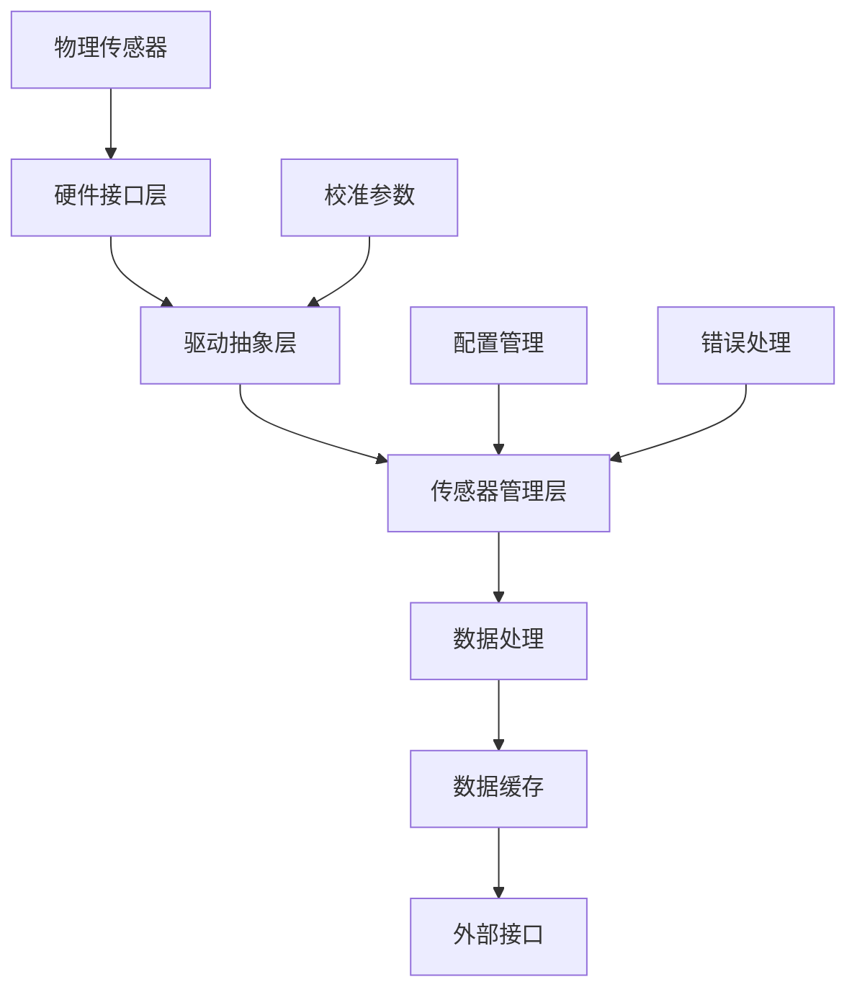

# 数据采集模块设计文档

## 1. 模块概述

### 1.1 模块功能

数据采集模块负责从各种传感器采集温度、湿度等环境数据，是整个 DTU 系统的核心功能模块。

### 1.2 在系统中的作用

- **数据源头**: 为整个系统提供实时环境数据
- **数据质量**: 确保采集数据的准确性和可靠性
- **接口统一**: 为不同类型传感器提供统一的接口

### 1.3 与其他模块的关系

```
数据采集模块
    ├─→ 数据管理模块 (提供原始数据)
    ├─→ 报警管理模块 (提供监控数据)
    ├─→ 通信管理模块 (提供上报数据)
    ├─→ 用户界面模块 (提供显示数据)
    └─← 配置管理模块 (获取配置参数)
```

---

## 2. 功能需求

### 2.1 支持的传感器类型

基于现有代码分析，需要支持以下传感器：

| 传感器类型         | 接口 | 数量   | 功能         | 优先级 |
| ------------------ | ---- | ------ | ------------ | ------ |
| SHT2x 系列         | I2C  | 1-3 个 | 温湿度采集   | P1     |
| RS485 温湿度传感器 | UART | 1-8 个 | 温湿度采集   | P1     |
| NTC 温度传感器     | ADC  | 1-3 个 | 温度采集     | P2     |
| 模拟量传感器       | ADC  | 多路   | 通用数据采集 | P2     |
| 气体传感器         | UART | 1 个   | 气体浓度检测 | P3     |

### 2.2 传感器配置类型

```c
// 基于原代码的传感器配置类型
typedef enum {
    SENSOR_TYPE_ONLY_RS485 = 0,     // 仅 RS485 传感器
    SENSOR_TYPE_ONLY_NTC = 1,       // 仅 NTC 传感器
    SENSOR_TYPE_RS485_NTC = 2,      // RS485 + NTC 传感器
    SENSOR_TYPE_RS485_GAS = 3,      // RS485 + 气体传感器
    SENSOR_TYPE_NTC_GAS = 4,        // NTC + 气体传感器
    SENSOR_TYPE_ONLY_GAS = 5,       // 仅气体传感器
    SENSOR_TYPE_COUNT
} sensor_type_config_t;
```

### 2.3 性能要求

| 指标     | 要求                    | 备注      |
| -------- | ----------------------- | --------- |
| 采集周期 | 1-10s 可配置            | 默认 1s   |
| 响应时间 | <100ms                  | 单次采集  |
| 精度     | 温度 ±0.1°C，湿度 ±2%RH | 校准后    |
| 稳定性   | 连续运行 7×24 小时      | 无故障    |
| 并发性   | 支持多传感器同时采集    | 基于 RTOS |

### 2.4 约束条件

- 硬件资源：RAM < 4KB，Flash < 20KB
- 功耗要求：低功耗设计
- 实时性：支持实时数据更新
- 可靠性：传感器故障检测和恢复

---

## 3. 接口设计

### 3.1 公共 API 接口

```c
// 数据采集模块初始化
int sensor_module_init(void);

// 传感器管理接口
int sensor_register(const sensor_config_t *config);
int sensor_unregister(sensor_id_t sensor_id);
int sensor_enable(sensor_id_t sensor_id, bool enable);

// 数据采集接口
int sensor_read(sensor_id_t sensor_id, sensor_data_t *data);
int sensor_read_all(sensor_data_t *data_array, size_t max_count);
int sensor_start_sampling(sensor_id_t sensor_id, uint32_t interval_ms);
int sensor_stop_sampling(sensor_id_t sensor_id);

// 回调注册接口
int sensor_register_callback(sensor_callback_t callback);
int sensor_set_data_ready_callback(sensor_id_t sensor_id, sensor_data_callback_t callback);

// 配置接口
int sensor_set_config(sensor_id_t sensor_id, const sensor_config_t *config);
int sensor_get_config(sensor_id_t sensor_id, sensor_config_t *config);
int sensor_calibrate(sensor_id_t sensor_id, const sensor_calibration_t *cal);

// 状态查询接口
sensor_status_t sensor_get_status(sensor_id_t sensor_id);
int sensor_get_info(sensor_id_t sensor_id, sensor_info_t *info);
```

### 3.2 数据结构定义

```c
// 传感器 ID 类型
typedef uint16_t sensor_id_t;

// 传感器类型枚举
typedef enum {
    SENSOR_TYPE_TEMPERATURE,
    SENSOR_TYPE_HUMIDITY,
    SENSOR_TYPE_TEMPERATURE_HUMIDITY,
    SENSOR_TYPE_GAS,
    SENSOR_TYPE_ANALOG,
    SENSOR_TYPE_COUNT
} sensor_type_t;

// 传感器接口类型
typedef enum {
    SENSOR_INTERFACE_I2C,
    SENSOR_INTERFACE_UART,
    SENSOR_INTERFACE_ADC,
    SENSOR_INTERFACE_SPI,
    SENSOR_INTERFACE_COUNT
} sensor_interface_t;

// 传感器数据值
typedef struct {
    float temperature;      // 温度值 (°C)
    float humidity;         // 湿度值 (%RH)
    float gas_concentration; // 气体浓度
    float analog_value;     // 模拟量值
    uint32_t timestamp;     // 时间戳 (ms)
    uint8_t quality;        // 数据质量 (0-100)
    uint8_t status;         // 数据状态标志
} sensor_data_t;

// 传感器配置
typedef struct {
    sensor_type_t type;
    sensor_interface_t interface;
    uint8_t address;        // I2C 地址或 UART 地址
    uint32_t baudrate;      // UART 波特率
    uint32_t sample_rate;   // 采样率 (ms)
    float temp_offset;      // 温度偏移校准
    float humi_offset;      // 湿度偏移校准
    bool enable_filter;     // 是否启用滤波
    uint8_t filter_depth;   // 滤波深度
} sensor_config_t;

// 传感器校准参数
typedef struct {
    float temp_k;           // 温度线性系数
    float temp_b;           // 温度偏移
    float humi_k;           // 湿度线性系数
    float humi_b;           // 湿度偏移
    uint16_t adc_zero;      // ADC 零点
    uint16_t adc_span;      // ADC 量程
} sensor_calibration_t;

// 传感器状态
typedef enum {
    SENSOR_STATUS_OFFLINE,
    SENSOR_STATUS_ONLINE,
    SENSOR_STATUS_ERROR,
    SENSOR_STATUS_CALIBRATING,
    SENSOR_STATUS_COUNT
} sensor_status_t;

// 传感器信息
typedef struct {
    char name[32];          // 传感器名称
    char model[32];         // 型号
    char version[16];       // 版本
    sensor_type_t type;     // 类型
    sensor_interface_t interface; // 接口
    uint32_t last_update;   // 最后更新时间
    uint32_t error_count;   // 错误计数
} sensor_info_t;
```

### 3.3 回调函数定义

```c
// 通用传感器回调
typedef void (*sensor_callback_t)(sensor_id_t sensor_id, sensor_event_t event);

// 数据就绪回调
typedef void (*sensor_data_callback_t)(sensor_id_t sensor_id, const sensor_data_t *data);

// 错误回调
typedef void (*sensor_error_callback_t)(sensor_id_t sensor_id, sensor_error_t error);

// 事件类型
typedef enum {
    SENSOR_EVENT_DATA_READY,
    SENSOR_EVENT_ERROR,
    SENSOR_EVENT_OFFLINE,
    SENSOR_EVENT_ONLINE,
    SENSOR_EVENT_CALIBRATION_DONE,
    SENSOR_EVENT_COUNT
} sensor_event_t;

// 错误类型
typedef enum {
    SENSOR_ERROR_NONE,
    SENSOR_ERROR_COMMUNICATION,
    SENSOR_ERROR_TIMEOUT,
    SENSOR_ERROR_INVALID_DATA,
    SENSOR_ERROR_HARDWARE_FAULT,
    SENSOR_ERROR_CALIBRATION_FAILED,
    SENSOR_ERROR_COUNT
} sensor_error_t;
```

---

## 4. 架构设计

### 4.1 内部架构图

```
┌─────────────────────────────────────────────────────────┐
│                    传感器管理层                         │
├─────────────────────────────────────────────────────────┤
│  传感器注册  │  配置管理  │  状态监控  │  数据缓存     │
├─────────────────────────────────────────────────────────┤
│                    驱动抽象层                           │
├─────────────────────────────────────────────────────────┤
│  SHT2x驱动   │  RS485驱动 │  ADC驱动   │  通用驱动     │
├─────────────────────────────────────────────────────────┤
│                    硬件接口层                           │
├─────────────────────────────────────────────────────────┤
│  I2C接口     │  UART接口  │  ADC接口   │  GPIO接口     │
└─────────────────────────────────────────────────────────┘
```

### 4.2 数据流设计



### 4.3 状态机设计

```c
// 传感器状态机
typedef enum {
    SENSOR_STATE_INIT,      // 初始化状态
    SENSOR_STATE_CONFIG,    // 配置状态
    SENSOR_STATE_READY,     // 就绪状态
    SENSOR_STATE_SAMPLING,  // 采样状态
    SENSOR_STATE_ERROR,     // 错误状态
    SENSOR_STATE_OFFLINE,   // 离线状态
} sensor_state_t;

// 状态转换表
static const sensor_state_transition_t state_transitions[] = {
    {SENSOR_STATE_INIT, SENSOR_EVENT_CONFIG_OK, SENSOR_STATE_CONFIG},
    {SENSOR_STATE_CONFIG, SENSOR_EVENT_READY, SENSOR_STATE_READY},
    {SENSOR_STATE_READY, SENSOR_EVENT_START_SAMPLING, SENSOR_STATE_SAMPLING},
    {SENSOR_STATE_SAMPLING, SENSOR_EVENT_STOP_SAMPLING, SENSOR_STATE_READY},
    {SENSOR_STATE_SAMPLING, SENSOR_EVENT_ERROR, SENSOR_STATE_ERROR},
    {SENSOR_STATE_ERROR, SENSOR_EVENT_RECOVER, SENSOR_STATE_READY},
};
```

---

## 5. 实现方案

### 5.1 技术选型

| 组件              | 选择方案        | 理由                       |
| ----------------- | --------------- | -------------------------- |
| **RTOS 任务调度** | Zephyr 工作队列 | 支持优先级调度，资源占用小 |
| **I2C 驱动**      | Zephyr I2C API  | 标准化接口，支持多主模式   |
| **UART 驱动**     | Zephyr UART API | 支持异步和中断模式         |
| **ADC 驱动**      | Zephyr ADC API  | 支持多通道和 DMA           |
| **数据滤波**      | 滑动平均+卡尔曼 | 平衡性能和精度             |
| **错误处理**      | 状态机+重试机制 | 提高系统鲁棒性             |

### 5.2 关键算法

#### 5.2.1 数据滤波算法

```c
// 滑动平均滤波器
typedef struct {
    float buffer[FILTER_DEPTH];
    uint8_t index;
    uint8_t count;
    float sum;
} moving_average_filter_t;

float apply_moving_average(moving_average_filter_t *filter, float value) {
    // 移除旧值
    if (filter->count == FILTER_DEPTH) {
        filter->sum -= filter->buffer[filter->index];
    } else {
        filter->count++;
    }

    // 添加新值
    filter->buffer[filter->index] = value;
    filter->sum += value;
    filter->index = (filter->index + 1) % FILTER_DEPTH;

    return filter->sum / filter->count;
}
```

#### 5.2.2 校准算法

```c
// 线性校准
float apply_calibration(float raw_value, const sensor_calibration_t *cal) {
    return raw_value * cal->temp_k + cal->temp_b;
}

// 温度补偿算法
float apply_temperature_compensation(float value, float temperature) {
    // 基于温度的线性补偿
    float temp_coeff = 0.001f; // 温度系数
    return value * (1.0f + temp_coeff * (temperature - 25.0f));
}
```

### 5.3 错误处理

#### 5.3.1 错误分类

```c
typedef enum {
    SENSOR_ERROR_NONE = 0,
    SENSOR_ERROR_INIT_FAILED,      // 初始化失败
    SENSOR_ERROR_COMM_TIMEOUT,     // 通信超时
    SENSOR_ERROR_CRC_MISMATCH,     // CRC校验错误
    SENSOR_ERROR_VALUE_INVALID,    // 数值无效
    SENSOR_ERROR_HARDWARE_FAULT,   // 硬件故障
    SENSOR_ERROR_COUNT
} sensor_error_t;
```

#### 5.3.2 错误恢复策略

```c
// 错误恢复配置
typedef struct {
    sensor_error_t error_type;
    uint8_t max_retries;        // 最大重试次数
    uint32_t retry_delay_ms;    // 重试延迟
    bool auto_recovery;         // 自动恢复
    error_action_t action;      // 恢复动作
} error_recovery_config_t;

static const error_recovery_config_t error_configs[] = {
    {SENSOR_ERROR_COMM_TIMEOUT, 3, 500, true, ACTION_RETRY},
    {SENSOR_ERROR_CRC_MISMATCH, 2, 100, true, ACTION_RETRY},
    {SENSOR_ERROR_HARDWARE_FAULT, 1, 5000, false, ACTION_DISABLE},
};
```

---

## 6. 开发任务分解

### 6.1 阶段一：基础架构 (1 周，5 个工作日)

| 状态 | 任务名称                      | 负责人   | 工期 | 依赖关系     | 交付标准              |
| ---- | ----------------------------- | -------- | ---- | ------------ | --------------------- |
| ⚫   | SENSOR_P1_T001 - 模块框架设计 | 张工程师 | 1 天 | 系统服务模块 | 架构文档+接口定义     |
| ⚫   | SENSOR_P1_T002 - 数据结构定义 | 张工程师 | 1 天 | T001         | 头文件+结构体定义     |
| ⚫   | SENSOR_P1_T003 - 状态机实现   | 张工程师 | 1 天 | T002         | 状态管理代码+单元测试 |
| ⚫   | SENSOR_P1_T004 - 内存池配置   | 张工程师 | 1 天 | T002         | 内存管理模块+测试     |
| ⚫   | SENSOR_P1_T005 - 基础框架测试 | 张工程师 | 1 天 | T001-T004    | 单元测试通过率>90%    |

**里程碑**: M1.1 - 基础架构完成 (第 1 周末)

- ✅ 验收标准：模块框架编译通过，基础测试全部通过
- ✅ 交付物：框架代码、单元测试、设计文档

### 6.2 阶段二：驱动开发 (2 周，10 个工作日)

| 状态 | 任务名称                         | 负责人     | 工期 | 依赖关系  | 交付标准             |
| ---- | -------------------------------- | ---------- | ---- | --------- | -------------------- |
| ⚫   | SENSOR_P2_T001 - I2C 驱动抽象层  | 张工程师   | 2 天 | HAL 模块  | I2C 接口+SHT2x 驱动  |
| ⚫   | SENSOR_P2_T002 - UART 驱动抽象层 | 李工程师   | 2 天 | HAL 模块  | UART 接口+RS485 驱动 |
| ⚫   | SENSOR_P2_T003 - ADC 驱动抽象层  | 李工程师   | 2 天 | HAL 模块  | ADC 接口+NTC 驱动    |
| ⚫   | SENSOR_P2_T004 - 传感器注册机制  | 张工程师   | 1 天 | T001-T003 | 动态注册+设备管理    |
| ⚫   | SENSOR_P2_T005 - 数据采集引擎    | 张工程师   | 2 天 | T004      | 采集任务+定时器      |
| ⚫   | SENSOR_P2_T006 - 驱动层集成测试  | 测试工程师 | 1 天 | T001-T005 | 硬件在环测试         |

**里程碑**: M1.2 - 驱动层完成 (第 3 周末)

- ✅ 验收标准：所有传感器类型驱动正常工作
- ✅ 交付物：驱动代码、测试报告、驱动文档

### 6.3 阶段三：功能完善 (1 周，5 个工作日)

| 状态 | 任务名称                        | 负责人     | 工期 | 依赖关系  | 交付标准          |
| ---- | ------------------------------- | ---------- | ---- | --------- | ----------------- |
| ⚫   | SENSOR_P3_T001 - 数据滤波算法   | 张工程师   | 1 天 | P2 完成   | 滤波器+性能测试   |
| ⚫   | SENSOR_P3_T002 - 校准功能实现   | 李工程师   | 1 天 | P2 完成   | 校准接口+精度测试 |
| ⚫   | SENSOR_P3_T003 - 错误处理机制   | 张工程师   | 1 天 | P2 完成   | 异常检测+自动恢复 |
| ⚫   | SENSOR_P3_T004 - 配置管理集成   | 李工程师   | 1 天 | 配置模块  | 参数持久化+热更新 |
| ⚫   | SENSOR_P3_T005 - 功能完整性测试 | 测试工程师 | 1 天 | T001-T004 | 功能测试 100%通过 |

**里程碑**: M1.3 - 功能完成 (第 4 周末)

- ✅ 验收标准：所有功能特性验证通过
- ✅ 交付物：完整功能代码、测试报告

### 6.4 阶段四：优化验收 (1 周，5 个工作日)

| 状态 | 任务名称                      | 负责人     | 工期 | 依赖关系  | 交付标准          |
| ---- | ----------------------------- | ---------- | ---- | --------- | ----------------- |
| ⚫   | SENSOR_P4_T001 - 性能优化调试 | 张工程师   | 2 天 | P3 完成   | 响应时间<100ms    |
| ⚫   | SENSOR_P4_T002 - 内存优化     | 李工程师   | 1 天 | P3 完成   | RAM 使用<4KB      |
| ⚫   | SENSOR_P4_T003 - 集成测试     | 测试工程师 | 1 天 | T001-T002 | 与其他模块联调    |
| ⚫   | SENSOR_P4_T004 - 文档完善     | 张工程师   | 1 天 | T001-T003 | API 文档+用户手册 |

**里程碑**: M1.4 - 模块验收 (第 5 周末)

- ✅ 验收标准：性能指标达标，集成测试通过
- ✅ 交付物：最终代码、完整文档、验收报告

---

## 7. 测试计划

### 7.1 单元测试

#### 7.1.1 测试框架

```c
// 使用Unity测试框架
#include "unity.h"
#include "sensor_module.h"

void setUp(void) {
    // 测试前准备
    sensor_module_init();
}

void tearDown(void) {
    // 测试后清理
    sensor_module_deinit();
}

// 测试用例示例
void test_sensor_registration(void) {
    sensor_config_t config = {
        .type = SENSOR_TYPE_TEMPERATURE_HUMIDITY,
        .interface = SENSOR_INTERFACE_I2C,
        .address = 0x40
    };

    sensor_id_t id = sensor_register(&config);
    TEST_ASSERT_NOT_EQUAL(SENSOR_ID_INVALID, id);

    sensor_status_t status = sensor_get_status(id);
    TEST_ASSERT_EQUAL(SENSOR_STATUS_OFFLINE, status);
}
```

#### 7.1.2 测试覆盖率目标

| 测试类型 | 覆盖率目标 | 工具     |
| -------- | ---------- | -------- |
| 语句覆盖 | >95%       | gcov     |
| 分支覆盖 | >90%       | gcov     |
| 函数覆盖 | 100%       | gcov     |
| 条件覆盖 | >85%       | 静态分析 |

### 7.2 集成测试

#### 7.2.1 硬件在环测试

```c
// HIL测试配置
typedef struct {
    const char *test_name;
    sensor_type_t sensor_type;
    float expected_range_min;
    float expected_range_max;
    uint32_t test_duration_ms;
} hil_test_config_t;

static const hil_test_config_t hil_tests[] = {
    {"SHT21温湿度测试", SENSOR_TYPE_TEMPERATURE_HUMIDITY, -40.0f, 80.0f, 30000},
    {"NTC温度测试", SENSOR_TYPE_TEMPERATURE, -20.0f, 60.0f, 20000},
    {"ADC模拟量测试", SENSOR_TYPE_ANALOG, 0.0f, 5.0f, 10000},
};
```

#### 7.2.2 压力测试

- **长时间运行**: 连续运行 24 小时，无内存泄漏
- **高频采样**: 100ms 周期采样，1 小时稳定运行
- **多传感器并发**: 8 个传感器同时工作，性能不下降

### 7.3 性能测试

#### 7.3.1 关键指标

| 指标         | 目标值 | 测试方法     |
| ------------ | ------ | ------------ |
| 单次采集延迟 | <100ms | 时间戳测量   |
| 内存使用     | <4KB   | 内存监控     |
| CPU 使用率   | <20%   | 性能分析     |
| 采样精度     | ±0.1°C | 校准设备对比 |

#### 7.3.2 性能监控

```c
// 性能统计结构
typedef struct {
    uint32_t total_samples;
    uint32_t success_samples;
    uint32_t error_samples;
    uint32_t avg_response_time_us;
    uint32_t max_response_time_us;
    uint32_t memory_usage_bytes;
} sensor_performance_stats_t;

// 性能监控API
sensor_performance_stats_t* sensor_get_performance_stats(void);
void sensor_reset_performance_stats(void);
```

---

## 8. 风险控制

### 8.1 技术风险

#### 8.1.1 高风险项

| 风险项         | 概率 | 影响 | 应对措施                | 负责人   |
| -------------- | ---- | ---- | ----------------------- | -------- |
| I2C 通信不稳定 | 中   | 高   | 增加重试机制+备用传感器 | 张工程师 |
| ADC 精度不足   | 低   | 中   | 软件校准+硬件滤波       | 李工程师 |
| 内存使用超限   | 中   | 高   | 优化数据结构+动态管理   | 张工程师 |

#### 8.1.2 缓解策略

```c
// 风险缓解配置
typedef struct {
    const char *risk_name;
    risk_level_t level;
    mitigation_action_t actions[MAX_ACTIONS];
    monitoring_metric_t metrics[MAX_METRICS];
} risk_mitigation_plan_t;

static const risk_mitigation_plan_t risk_plans[] = {
    {
        .risk_name = "I2C通信不稳定",
        .level = RISK_HIGH,
        .actions = {
            {ACTION_RETRY, 3, 100},
            {ACTION_FALLBACK, 1, 0},
            {ACTION_ALERT, 1, 0}
        },
        .metrics = {
            {METRIC_ERROR_RATE, 5.0f},
            {METRIC_RESPONSE_TIME, 200.0f}
        }
    }
};
```

### 8.2 进度风险

#### 8.2.1 关键路径风险

- **依赖风险**: HAL 模块延期影响驱动开发
- **技能风险**: Zephyr RTOS 学习曲线
- **资源风险**: 测试硬件设备不足

#### 8.2.2 应对计划

1. **并行开发**: 模拟器环境先行开发
2. **技能培训**: 提前 2 周 Zephyr 培训
3. **备用方案**: 准备备用硬件和替代传感器

---

## 9. 交付标准

### 9.1 功能验收标准

#### 9.1.1 基本功能

- ✅ 支持 SHT2x、RS485、NTC、ADC 四种传感器接口
- ✅ 支持传感器动态注册和注销
- ✅ 支持 1-10 秒可配置采样周期
- ✅ 支持数据滤波和校准功能
- ✅ 支持错误检测和自动恢复

#### 9.1.2 高级功能

- ✅ 支持多传感器并发采集
- ✅ 支持配置参数热更新
- ✅ 支持性能统计和监控
- ✅ 支持低功耗模式

### 9.2 性能验收标准

| 性能指标 | 验收标准                | 测试方法     |
| -------- | ----------------------- | ------------ |
| 响应时间 | <100ms                  | 实时测量     |
| 精度     | 温度 ±0.1°C，湿度 ±2%RH | 校准设备对比 |
| 稳定性   | 24 小时无故障运行       | 长期测试     |
| 资源使用 | RAM<4KB, Flash<20KB     | 编译报告     |
| 错误恢复 | 自动恢复率>95%          | 故障注入测试 |

### 9.3 质量验收标准

#### 9.3.1 代码质量

- ✅ 符合 MISRA C 2012 编码规范
- ✅ 静态分析无 Critical 级别告警
- ✅ 单元测试覆盖率>90%
- ✅ 集成测试全部通过
- ✅ 代码评审问题修复率 100%

#### 9.3.2 文档质量

- ✅ API 接口文档完整
- ✅ 用户使用手册清晰
- ✅ 设计文档和代码一致
- ✅ 测试报告详实
- ✅ 问题跟踪记录完整

---

## 10. 附录

### 10.1 参考资料

1. **Zephyr RTOS 文档**: [https://docs.zephyrproject.org/](https://docs.zephyrproject.org/)
2. **SHT2x 数据手册**: Sensirion 官方技术文档
3. **NANO100B 参考手册**: Nuvoton 技术文档
4. **Modbus 协议规范**: Modbus 组织标准文档

### 10.2 开发工具

| 工具类型 | 推荐工具           | 版本要求 |
| -------- | ------------------ | -------- |
| IDE      | Visual Studio Code | ≥1.60    |
| 编译器   | GCC ARM Embedded   | ≥10.3    |
| 调试器   | J-Link             | ≥7.0     |
| 静态分析 | PC-lint Plus       | ≥2.0     |
| 单元测试 | Unity              | ≥2.5     |

### 10.3 版本历史

| 版本   | 日期       | 更新内容               | 作者     |
| ------ | ---------- | ---------------------- | -------- |
| V1.0.0 | 2024-12-XX | 初始版本，基础设计     | 张工程师 |
| V1.1.0 | 2024-12-XX | 增加任务分解和状态跟踪 | 张工程师 |
| V1.2.0 | 2024-12-XX | 完善测试计划和风险控制 | 张工程师 |

---

**创建时间**: 2024 年 12 月  
**负责人**: 张工程师  
**版本**: V1.2.0  
**下次更新**: 开发过程中持续更新
