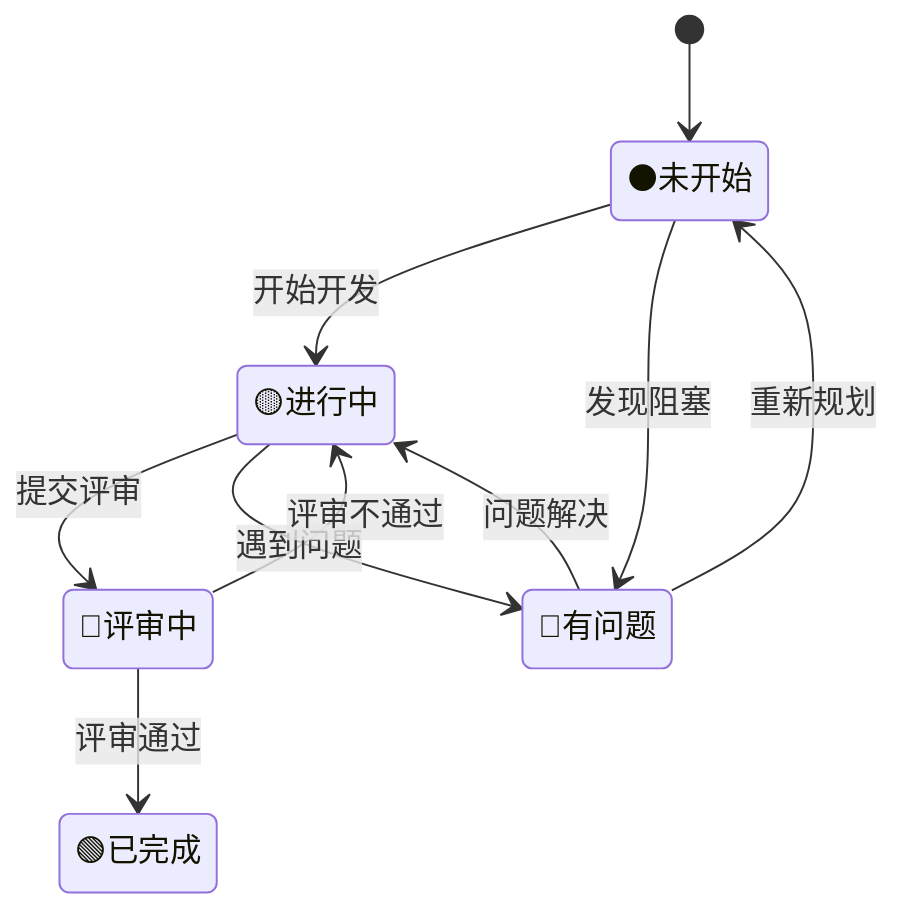

# 任务跟踪系统设计文档

## 1. 系统概述

### 1.1 设计目标

为冷库 DTU 重构项目提供完整的任务跟踪和进度管理系统，确保每个开发任务都有明确的状态标识、负责人分配和完成标准。

### 1.2 系统功能

- **任务状态管理**: 5 级状态标识系统
- **进度可视化**: 实时进度统计和展示
- **依赖关系追踪**: 任务间依赖关系管理
- **质量控制**: 完成标准和验收机制
- **风险预警**: 进度延期和风险识别

---

## 2. 状态标识系统

### 2.1 标准状态定义

| 状态标识 | 英文名称    | 中文含义 | 描述                           | 颜色编码 |
| -------- | ----------- | -------- | ------------------------------ | -------- |
| ⚫       | NOT_STARTED | 未开始   | 任务尚未开始，等待前置条件满足 | 黑色     |
| 🟡       | IN_PROGRESS | 进行中   | 任务正在进行，需要持续跟踪     | 黄色     |
| 🔵       | IN_REVIEW   | 评审中   | 任务完成，等待代码评审         | 蓝色     |
| 🟢       | COMPLETED   | 已完成   | 任务完成并通过验收             | 绿色     |
| 🔴       | BLOCKED     | 有问题   | 遇到阻塞问题，需要支持解决     | 红色     |

### 2.2 状态转换规则



### 2.3 状态变更记录

```c
// 任务状态变更记录结构
typedef struct {
    char task_id[32];           // 任务ID
    task_status_t old_status;   // 原状态
    task_status_t new_status;   // 新状态
    char operator[32];          // 操作人
    char timestamp[32];         // 变更时间
    char comment[256];          // 变更说明
} status_change_record_t;
```

---

## 3. 任务细分体系

### 3.1 任务层级结构

```
模块 (Module)
├── 阶段 (Phase)
│   ├── 里程碑 (Milestone)
│   │   ├── 任务 (Task)
│   │   │   ├── 子任务 (Subtask)
│   │   │   └── 验收点 (Checkpoint)
│   │   └── 交付物 (Deliverable)
│   └── 评审点 (Review Point)
```

### 3.2 任务标识规范

```bash
# 任务ID命名规范: [模块]_[阶段]_[任务编号]_[子任务编号]
# 示例:
SENSOR_P1_T001_S001    # 数据采集模块-阶段1-任务1-子任务1
COMM_P2_T003_S002      # 通信管理模块-阶段2-任务3-子任务2
```

### 3.3 任务属性定义

```c
typedef struct {
    char id[32];                    // 任务ID
    char name[64];                  // 任务名称
    char description[256];          // 任务描述
    task_priority_t priority;       // 优先级
    task_status_t status;           // 当前状态
    char assignee[32];              // 负责人
    char reviewer[32];              // 评审人
    uint32_t estimated_hours;       // 预估工时
    uint32_t actual_hours;          // 实际工时
    char start_date[32];            // 开始日期
    char due_date[32];              // 截止日期
    char completion_date[32];       // 完成日期
    float progress_percent;         // 完成百分比
    char dependencies[256];         // 依赖任务列表
    char blockers[256];             // 阻塞问题描述
    char deliverables[256];         // 交付物列表
    task_acceptance_t acceptance;   // 验收标准
} task_detail_t;
```

---

## 4. 进度跟踪机制

### 4.1 模块级进度统计

```c
typedef struct {
    char module_name[64];           // 模块名称
    uint32_t total_tasks;           // 总任务数
    uint32_t not_started;           // 未开始任务数
    uint32_t in_progress;           // 进行中任务数
    uint32_t in_review;             // 评审中任务数
    uint32_t completed;             // 已完成任务数
    uint32_t blocked;               // 被阻塞任务数
    float completion_rate;          // 完成率 (%)
    uint32_t estimated_total_hours; // 预估总工时
    uint32_t actual_total_hours;    // 实际总工时
    char critical_path[512];        // 关键路径任务
    char next_milestones[256];      // 下一个里程碑
} module_progress_t;
```

### 4.2 项目级进度仪表板

```markdown
## 📊 项目总体进度 (2024-12-XX 更新)

### 总体统计

- **总任务数**: 160 个
- **已完成**: 8 个 (5.0%) 🟢
- **进行中**: 12 个 (7.5%) 🟡
- **评审中**: 3 个 (1.9%) 🔵
- **未开始**: 135 个 (84.4%) ⚫
- **有问题**: 2 个 (1.3%) 🔴

### 模块进度分布

| 模块              | 总任务 | 完成率 | 状态分布             | 风险等级 |
| ----------------- | ------ | ------ | -------------------- | -------- |
| 01-数据采集模块   | 20     | 15%    | 🟢3 🟡2 🔵1 ⚫14 🔴0 | 🟢 低    |
| 02-通信管理模块   | 22     | 5%     | 🟢1 🟡1 🔵0 ⚫19 🔴1 | 🟡 中    |
| 03-数据管理模块   | 25     | 0%     | 🟢0 🟡0 🔵0 ⚫25 🔴0 | 🟢 低    |
| 04-报警管理模块   | 18     | 0%     | 🟢0 🟡0 🔵0 ⚫18 🔴0 | 🟢 低    |
| 05-用户界面模块   | 20     | 10%    | 🟢2 🟡1 🔵0 ⚫17 🔴0 | 🟢 低    |
| 06-系统服务模块   | 15     | 20%    | 🟢3 🟡0 🔵1 ⚫11 🔴0 | 🟢 低    |
| 07-硬件抽象层模块 | 18     | 0%     | 🟢0 🟡0 🔵0 ⚫17 🔴1 | 🟡 中    |
| 08-配置管理模块   | 12     | 0%     | 🟢0 🟡0 🔵0 ⚫12 🔴0 | 🟢 低    |
| 09-OTA 升级模块   | 10     | 0%     | 🟢0 🟡0 🔵0 ⚫10 🔴0 | 🟢 低    |
```

### 4.3 关键路径分析

```markdown
### 🚨 关键路径任务 (影响项目进度)

1. **HAL_P1_T001** - 硬件抽象层基础架构 ⚫ (阻塞多个模块)
2. **SYS_P1_T002** - Zephyr RTOS 集成 🟡 (85% 完成)
3. **COMM_P1_T001** - Modbus 协议栈实现 🔴 (CRC 校验问题)
4. **SENSOR_P1_T003** - 传感器驱动接口 🟡 (60% 完成)

### ⚠️ 风险预警

- **高风险**: COMM 模块 Modbus 实现遇到技术难题
- **中风险**: HAL 模块设计复杂度超预期
- **进度风险**: P1 阶段预计延期 1 周
```

---

## 5. 质量控制体系

### 5.1 完成标准模板

```c
typedef struct {
    char acceptance_id[32];         // 验收ID
    char criteria[512];             // 验收标准
    char test_cases[512];           // 测试用例
    bool code_review_passed;        // 代码评审通过
    bool unit_tests_passed;         // 单元测试通过
    bool integration_tests_passed;  // 集成测试通过
    bool documentation_complete;    // 文档完整
    char reviewer_approval[32];     // 评审人签字
    char qa_approval[32];           // QA签字
    char completion_evidence[256];  // 完成证据
} acceptance_criteria_t;
```

### 5.2 代码质量检查清单

```markdown
### 📋 代码质量检查清单

#### 基础要求 ✅

- [ ] 代码符合项目编码规范
- [ ] 函数长度不超过 100 行
- [ ] 圈复杂度不超过 10
- [ ] 内存泄漏检查通过
- [ ] 静态代码分析无警告

#### 功能要求 ✅

- [ ] 所有功能按设计文档实现
- [ ] 错误处理机制完善
- [ ] 边界条件处理正确
- [ ] 性能指标达到要求
- [ ] 接口兼容性验证通过

#### 测试要求 ✅

- [ ] 单元测试覆盖率 > 80%
- [ ] 所有测试用例通过
- [ ] 集成测试验证通过
- [ ] 压力测试验证通过
- [ ] 回归测试通过

#### 文档要求 ✅

- [ ] API 文档完整
- [ ] 设计文档更新
- [ ] 用户手册更新
- [ ] 变更记录完整
- [ ] 知识库文档完整
```

---

## 6. 实施工具与流程

### 6.1 工具推荐

#### 6.1.1 项目管理工具

- **主工具**: GitHub Projects (免费，集成度高)
- **备选**: Trello, Asana, 禅道

#### 6.1.2 文档管理

- **主工具**: GitHub Wiki + Markdown
- **备选**: Confluence, 腾讯文档

#### 6.1.3 代码质量工具

- **静态分析**: Cppcheck, PC-lint
- **单元测试**: Unity, CMocka
- **覆盖率**: gcov, lcov

### 6.2 日常流程

#### 6.2.1 每日站会 (Daily Standup)

```markdown
### 📅 每日站会记录模板

**日期**: 2024-12-XX
**参与者**: [团队成员列表]

#### 昨日完成

- [姓名]: 完成任务 SENSOR_P1_T001_S002 ✅
- [姓名]: 解决 COMM 模块 CRC 问题 🔧

#### 今日计划

- [姓名]: 开始任务 SENSOR_P1_T002_S001
- [姓名]: 继续调试LoRa通信

#### 遇到问题

- [姓名]: HAL 层接口设计需要讨论 🔴
- [姓名]: 需要硬件支持调试 ⚠️

#### 下次站会: 明日 9:00 AM
```

#### 6.2.2 周报模板

```markdown
### 📈 项目周报 (第 X 周)

**报告期**: 2024-12-XX ~ 2024-12-XX
**报告人**: [项目负责人]

#### 总体进度

- **完成任务**: 8 个 (+3)
- **新增任务**: 2 个
- **解决问题**: 1 个关键阻塞

#### 重要里程碑

- ✅ Zephyr RTOS 基础集成完成
- 🟡 传感器驱动框架 50%完成
- ⚫ Modbus 协议栈重构待开始

#### 风险与问题

- 🔴 **高**: COMM 模块技术难题
- 🟡 **中**: 人员技能培训需求
- 🟢 **低**: 开发环境配置

#### 下周计划

1. 完成 HAL 层基础接口设计
2. 启动数据管理模块开发
3. 解决 Modbus CRC 校验问题
4. 举行技术分享会

#### 需要支持

- 硬件调试板申请 (2 套)
- LoRa 模块技术支持
- 代码评审工具配置
```

---

## 7. 自动化集成

### 7.1 GitHub Actions 集成

```yaml
# .github/workflows/task-tracking.yml
name: Task Tracking Update

on:
  push:
    paths:
      - "DOC/MODULES/*.md"
  pull_request:
    paths:
      - "src/**"

jobs:
  update-progress:
    runs-on: ubuntu-latest
    steps:
      - uses: actions/checkout@v3

      - name: Extract Task Status
        run: |
          python scripts/extract_task_status.py

      - name: Update Progress Dashboard
        run: |
          python scripts/update_dashboard.py

      - name: Generate Report
        run: |
          python scripts/generate_weekly_report.py

      - name: Commit Updates
        run: |
          git config --local user.email "action@github.com"
          git config --local user.name "GitHub Action"
          git add DOC/PROGRESS/
          git commit -m "Auto-update task progress" || exit 0
          git push
```

### 7.2 状态同步脚本

```python
#!/usr/bin/env python3
# scripts/extract_task_status.py

import re
import json
from pathlib import Path

class TaskStatusExtractor:
    def __init__(self):
        self.status_pattern = r'([⚫🟡🔵🟢🔴])\s*([^|]+)\|([^|]+)\|([^|]+)\|([^|]+)'
        self.modules = []

    def extract_from_markdown(self, file_path):
        """从Markdown文件提取任务状态"""
        with open(file_path, 'r', encoding='utf-8') as f:
            content = f.read()

        tasks = []
        matches = re.findall(self.status_pattern, content)

        for match in matches:
            status, task_name, assignee, due_date, _ = match
            tasks.append({
                'status': status,
                'name': task_name.strip(),
                'assignee': assignee.strip(),
                'due_date': due_date.strip(),
                'module': file_path.stem
            })

        return tasks

    def generate_summary(self):
        """生成项目总体进度摘要"""
        total_stats = {
            '⚫': 0, '🟡': 0, '🔵': 0, '🟢': 0, '🔴': 0
        }

        # 扫描所有模块文档
        doc_path = Path('DOC/MODULES')
        for md_file in doc_path.glob('*.md'):
            if md_file.name != 'README.md':
                tasks = self.extract_from_markdown(md_file)
                for task in tasks:
                    total_stats[task['status']] += 1

        return total_stats

if __name__ == "__main__":
    extractor = TaskStatusExtractor()
    summary = extractor.generate_summary()

    # 保存到JSON文件供其他脚本使用
    with open('DOC/PROGRESS/current_status.json', 'w') as f:
        json.dump(summary, f, ensure_ascii=False, indent=2)
```

---

## 8. 培训与支持

### 8.1 团队培训计划

```markdown
### 👨‍🏫 任务跟踪系统培训计划

#### 第一阶段: 系统介绍 (1 小时)

- 任务跟踪系统概述
- 状态标识含义和使用
- 工具平台操作指南
- 日常流程说明

#### 第二阶段: 实践操作 (1 小时)

- 创建和更新任务状态
- 填写进度报告
- 问题上报和处理
- 代码评审流程

#### 第三阶段: 高级功能 (30 分钟)

- 自动化脚本使用
- 进度分析和预警
- 质量度量指标
- 最佳实践分享
```

### 8.2 支持文档

```markdown
### 📚 支持文档列表

1. **快速上手指南** - 5 分钟学会基本操作
2. **状态更新规范** - 标准化状态变更流程
3. **问题处理手册** - 常见问题和解决方案
4. **工具使用手册** - GitHub Projects 详细操作
5. **最佳实践集** - 成功经验和技巧分享
```

---

## 9. 持续改进机制

### 9.1 效果评估指标

```c
typedef struct {
    float task_completion_rate;     // 任务完成率
    float on_time_delivery_rate;    // 按时交付率
    float quality_pass_rate;        // 质量通过率
    uint32_t avg_task_cycle_time;   // 平均任务周期
    uint32_t defect_density;        // 缺陷密度
    float team_satisfaction;        // 团队满意度
    uint32_t process_efficiency;    // 流程效率
} tracking_metrics_t;
```

### 9.2 改进建议收集

```markdown
### 💡 改进建议模板

**建议类型**: [流程改进/工具优化/培训需求/其他]
**提出人**: [姓名]
**提出时间**: [日期]
**当前问题**: [描述现状和问题]
**改进建议**: [具体改进方案]
**预期收益**: [预期的改进效果]
**实施成本**: [时间/人力成本评估]
**优先级**: [高/中/低]
```

---

## 10. 总结与展望

### 10.1 系统价值

1. **提升透明度**: 项目进度一目了然
2. **强化责任**: 任务责任人明确
3. **风险预警**: 及时发现和处理风险
4. **质量保证**: 完善的质量控制体系
5. **持续改进**: 数据驱动的流程优化

### 10.2 下一步计划

1. **短期 (1-2 周)**:

   - 部署基础跟踪系统
   - 团队培训和推广
   - 完善工具配置

2. **中期 (1-2 月)**:

   - 优化自动化流程
   - 完善度量体系
   - 收集改进反馈

3. **长期 (3-6 月)**:
   - 智能预警系统
   - AI 辅助进度预测
   - 最佳实践总结

---

**创建时间**: 2024 年 12 月  
**负责人**: 项目技术负责人  
**版本**: V1.0.0  
**下次更新**: 根据实施反馈持续更新
