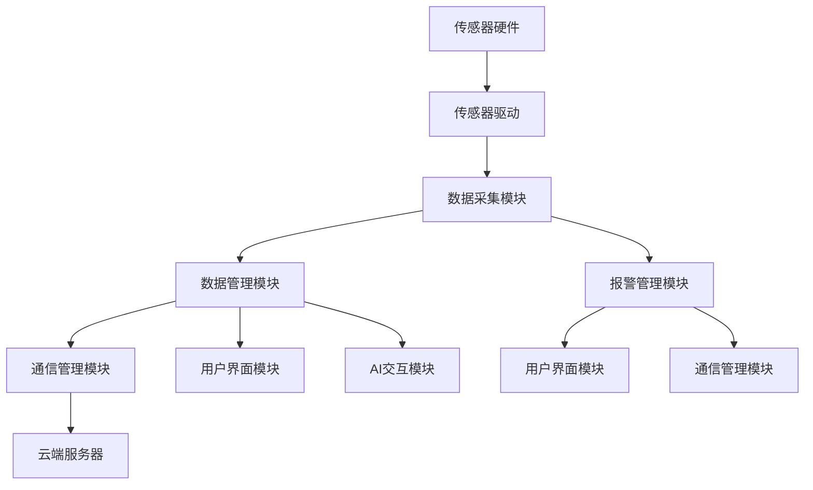
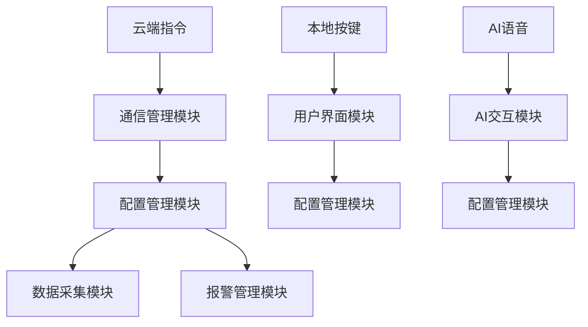

# 模块集成协调设计文档

## 1. 集成架构概述

### 1.1 集成目标

基于 Zephyr RTOS 构建模块化、低耦合、高内聚的冷库 DTU 系统，确保各模块协调工作，实现系统整体功能。

### 1.2 集成挑战

- **资源约束**: 128KB Flash + 16KB RAM 的严格限制
- **实时性要求**: 毫秒级响应和确定性调度
- **多协议并发**: Modbus、LoRa、4G 同时工作
- **数据一致性**: 多模块间数据同步和状态一致性
- **故障隔离**: 单模块故障不影响系统稳定性

---

## 2. 模块依赖关系分析

### 2.1 依赖层次图

```
┌─────────────────────────────────────────────────────────┐
│                     应用层 (Level 4)                    │
├─────────────────────────────────────────────────────────┤
│  AI交互模块  │  用户界面模块  │  OTA升级模块           │
├─────────────────────────────────────────────────────────┤
│                     业务层 (Level 3)                    │
├─────────────────────────────────────────────────────────┤
│  数据采集模块  │  报警管理模块  │  数据管理模块         │
├─────────────────────────────────────────────────────────┤
│                     服务层 (Level 2)                    │
├─────────────────────────────────────────────────────────┤
│  通信管理模块  │  配置管理模块  │  系统服务模块         │
├─────────────────────────────────────────────────────────┤
│                     基础层 (Level 1)                    │
├─────────────────────────────────────────────────────────┤
│                  硬件抽象层模块                         │
├─────────────────────────────────────────────────────────┤
│                   Zephyr RTOS 内核                     │
├─────────────────────────────────────────────────────────┤
│                   硬件平台 (NANO100B)                   │
└─────────────────────────────────────────────────────────┘
```

### 2.2 关键依赖关系

#### 2.2.1 强依赖 (必须先完成)

```c
// 硬依赖关系定义
typedef struct {
    module_id_t dependent;      // 依赖方模块
    module_id_t provider;       // 被依赖方模块
    dependency_type_t type;     // 依赖类型
    priority_t priority;        // 依赖优先级
    char description[128];      // 依赖描述
} module_dependency_t;

// 关键依赖表
static const module_dependency_t critical_dependencies[] = {
    // Level 1 -> Level 2 依赖
    {MOD_COMM, MOD_HAL, DEP_HARDWARE, PRI_CRITICAL, "通信需要UART/SPI等硬件接口"},
    {MOD_CONFIG, MOD_HAL, DEP_HARDWARE, PRI_CRITICAL, "配置需要Flash存储接口"},
    {MOD_SYSTEM, MOD_HAL, DEP_HARDWARE, PRI_CRITICAL, "系统服务需要时钟/看门狗等"},

    // Level 2 -> Level 3 依赖
    {MOD_SENSOR, MOD_HAL, DEP_HARDWARE, PRI_CRITICAL, "传感器需要I2C/ADC接口"},
    {MOD_SENSOR, MOD_CONFIG, DEP_SERVICE, PRI_HIGH, "传感器需要配置参数"},
    {MOD_DATA, MOD_CONFIG, DEP_SERVICE, PRI_HIGH, "数据管理需要存储配置"},
    {MOD_ALARM, MOD_SENSOR, DEP_DATA, PRI_HIGH, "报警依赖传感器数据"},

    // Level 3 -> Level 4 依赖
    {MOD_UI, MOD_DATA, DEP_DATA, PRI_MEDIUM, "界面显示需要数据源"},
    {MOD_AI, MOD_COMM, DEP_SERVICE, PRI_LOW, "AI交互需要通信服务"},
    {MOD_OTA, MOD_COMM, DEP_SERVICE, PRI_LOW, "OTA需要网络通信"},
};
```

#### 2.2.2 弱依赖 (可选或异步)

```c
// 弱依赖关系 - 可延迟初始化
static const module_dependency_t optional_dependencies[] = {
    {MOD_UI, MOD_ALARM, DEP_EVENT, PRI_LOW, "界面响应报警事件"},
    {MOD_AI, MOD_SENSOR, DEP_DATA, PRI_LOW, "AI分析传感器数据"},
    {MOD_OTA, MOD_CONFIG, DEP_SERVICE, PRI_LOW, "OTA更新配置信息"},
};
```

---

## 3. 接口设计标准

### 3.1 统一接口规范

#### 3.1.1 模块接口结构

```c
// 标准模块接口定义
typedef struct {
    const char *name;               // 模块名称
    uint32_t version;              // 接口版本
    module_state_t state;          // 模块状态

    // 生命周期接口
    int (*init)(const void *config);
    int (*start)(void);
    int (*stop)(void);
    int (*deinit)(void);

    // 状态查询接口
    module_state_t (*get_state)(void);
    int (*get_info)(module_info_t *info);
    int (*get_statistics)(module_stats_t *stats);

    // 配置接口
    int (*set_config)(const void *config);
    int (*get_config)(void *config);

    // 事件接口
    int (*register_callback)(event_type_t type, event_callback_t callback);
    int (*unregister_callback)(event_type_t type);

    // 服务接口 (模块特定)
    const void *service_api;
} module_interface_t;
```

#### 3.1.2 数据交换接口

```c
// 模块间数据交换结构
typedef struct {
    uint32_t message_id;           // 消息ID
    module_id_t source;            // 源模块
    module_id_t destination;       // 目标模块
    message_type_t type;           // 消息类型
    uint32_t timestamp;            // 时间戳
    uint16_t data_len;             // 数据长度
    uint8_t *data;                 // 数据内容
    message_priority_t priority;   // 消息优先级
    uint32_t timeout_ms;           // 超时时间
} inter_module_message_t;
```

### 3.2 事件驱动机制

#### 3.2.1 事件类型定义

```c
// 系统事件类型
typedef enum {
    // 系统级事件 (0x0000-0x00FF)
    EVENT_SYSTEM_INIT = 0x0001,
    EVENT_SYSTEM_START = 0x0002,
    EVENT_SYSTEM_SHUTDOWN = 0x0003,
    EVENT_SYSTEM_ERROR = 0x0004,

    // 硬件事件 (0x0100-0x01FF)
    EVENT_HARDWARE_READY = 0x0101,
    EVENT_HARDWARE_ERROR = 0x0102,
    EVENT_HARDWARE_RESET = 0x0103,

    // 通信事件 (0x0200-0x02FF)
    EVENT_COMM_CONNECTED = 0x0201,
    EVENT_COMM_DISCONNECTED = 0x0202,
    EVENT_COMM_DATA_RECEIVED = 0x0203,
    EVENT_COMM_ERROR = 0x0204,

    // 传感器事件 (0x0300-0x03FF)
    EVENT_SENSOR_DATA_READY = 0x0301,
    EVENT_SENSOR_ERROR = 0x0302,
    EVENT_SENSOR_CALIBRATION = 0x0303,

    // 报警事件 (0x0400-0x04FF)
    EVENT_ALARM_TRIGGERED = 0x0401,
    EVENT_ALARM_CLEARED = 0x0402,
    EVENT_ALARM_CONFIG_CHANGED = 0x0403,

    // 配置事件 (0x0500-0x05FF)
    EVENT_CONFIG_UPDATED = 0x0501,
    EVENT_CONFIG_BACKUP = 0x0502,
    EVENT_CONFIG_RESTORE = 0x0503,

} system_event_type_t;
```

#### 3.2.2 事件分发机制

```c
// 事件分发器结构
typedef struct {
    k_msgq_t event_queue;          // 事件队列
    k_thread_t dispatcher_thread;  // 分发线程
    k_mutex_t subscriber_mutex;    // 订阅者互斥锁

    // 事件订阅表
    struct {
        event_type_t event_type;
        event_callback_t callback;
        void *user_data;
        bool active;
    } subscribers[MAX_EVENT_SUBSCRIBERS];

    uint32_t total_events;         // 总事件数
    uint32_t processed_events;     // 已处理事件数
    uint32_t dropped_events;       // 丢弃事件数
} event_dispatcher_t;

// 事件分发API
int event_subscribe(event_type_t type, event_callback_t callback, void *user_data);
int event_unsubscribe(event_type_t type, event_callback_t callback);
int event_publish(event_type_t type, const void *data, size_t data_len);
int event_publish_async(event_type_t type, const void *data, size_t data_len);
```

---

## 4. 启动与初始化顺序

### 4.1 分阶段启动策略

```c
// 启动阶段定义
typedef enum {
    BOOT_STAGE_HARDWARE,      // 硬件初始化
    BOOT_STAGE_KERNEL,        // 内核启动
    BOOT_STAGE_DRIVERS,       // 驱动初始化
    BOOT_STAGE_SERVICES,      // 服务启动
    BOOT_STAGE_APPLICATIONS,  // 应用启动
    BOOT_STAGE_COMPLETE,      // 启动完成
} boot_stage_t;

// 启动序列表
typedef struct {
    boot_stage_t stage;
    module_id_t module;
    init_priority_t priority;
    uint32_t timeout_ms;
    bool required;
    const char *description;
} boot_sequence_entry_t;
```

### 4.2 启动序列详细规划

```c
static const boot_sequence_entry_t boot_sequence[] = {
    // 第一阶段: 硬件初始化 (0-500ms)
    {BOOT_STAGE_HARDWARE, MOD_HAL, INIT_PRI_CRITICAL, 100, true, "硬件抽象层初始化"},

    // 第二阶段: 内核启动 (500-1000ms)
    {BOOT_STAGE_KERNEL, MOD_SYSTEM, INIT_PRI_CRITICAL, 200, true, "系统服务初始化"},
    {BOOT_STAGE_KERNEL, MOD_CONFIG, INIT_PRI_HIGH, 150, true, "配置管理初始化"},

    // 第三阶段: 驱动初始化 (1000-2000ms)
    {BOOT_STAGE_DRIVERS, MOD_SENSOR, INIT_PRI_HIGH, 300, true, "传感器驱动初始化"},
    {BOOT_STAGE_DRIVERS, MOD_COMM, INIT_PRI_HIGH, 400, true, "通信模块初始化"},

    // 第四阶段: 服务启动 (2000-3000ms)
    {BOOT_STAGE_SERVICES, MOD_DATA, INIT_PRI_MEDIUM, 200, true, "数据管理服务"},
    {BOOT_STAGE_SERVICES, MOD_ALARM, INIT_PRI_MEDIUM, 150, true, "报警管理服务"},

    // 第五阶段: 应用启动 (3000-4000ms)
    {BOOT_STAGE_APPLICATIONS, MOD_UI, INIT_PRI_LOW, 300, false, "用户界面"},
    {BOOT_STAGE_APPLICATIONS, MOD_AI, INIT_PRI_LOW, 200, false, "AI交互模块"},
    {BOOT_STAGE_APPLICATIONS, MOD_OTA, INIT_PRI_LOW, 100, false, "OTA升级模块"},
};
```

### 4.3 启动状态监控

```c
// 启动进度监控
typedef struct {
    boot_stage_t current_stage;
    uint32_t stage_start_time;
    uint32_t total_start_time;

    struct {
        module_id_t module;
        module_state_t state;
        uint32_t init_time;
        int error_code;
    } module_status[MAX_MODULES];

    uint32_t success_count;
    uint32_t failed_count;
    uint32_t timeout_count;
} boot_monitor_t;

// 启动监控API
int boot_monitor_init(void);
int boot_monitor_stage_start(boot_stage_t stage);
int boot_monitor_module_result(module_id_t module, int result);
boot_status_t boot_monitor_get_status(void);
```

---

## 5. 数据流设计

### 5.1 数据流路径规划

#### 5.1.1 主数据流



#### 5.1.2 控制流



### 5.2 数据缓冲与同步

#### 5.2.1 数据缓冲池设计

```c
// 数据缓冲池结构
typedef struct {
    k_mutex_t mutex;              // 互斥锁
    k_sem_t available_sem;        // 可用缓冲信号量
    k_sem_t used_sem;             // 已用缓冲信号量

    struct {
        bool in_use;
        uint32_t timestamp;
        data_type_t type;
        uint16_t size;
        uint8_t data[MAX_DATA_SIZE];
    } buffers[DATA_BUFFER_COUNT];

    uint32_t read_index;
    uint32_t write_index;
    uint32_t overflow_count;
} data_buffer_pool_t;

// 数据缓冲API
data_buffer_t* data_buffer_get(k_timeout_t timeout);
int data_buffer_put(data_buffer_t *buffer);
int data_buffer_copy(const void *src, size_t size, data_type_t type);
```

#### 5.2.2 数据同步机制

```c
// 数据同步状态
typedef struct {
    uint32_t sequence_number;     // 序列号
    uint32_t timestamp;           // 时间戳
    data_status_t status;         // 数据状态
    uint16_t checksum;            // 校验和
    module_id_t producer;         // 生产者模块
    module_id_t consumer;         // 消费者模块
} data_sync_header_t;

// 数据同步API
int data_sync_register_producer(module_id_t module, data_type_t type);
int data_sync_register_consumer(module_id_t module, data_type_t type);
int data_sync_publish(data_type_t type, const void *data, size_t size);
int data_sync_subscribe(data_type_t type, data_callback_t callback);
```

---

## 6. 错误处理与恢复

### 6.1 错误分类与策略

#### 6.1.1 错误分级

```c
typedef enum {
    ERROR_LEVEL_FATAL,      // 致命错误，系统重启
    ERROR_LEVEL_CRITICAL,   // 关键错误，模块重启
    ERROR_LEVEL_WARNING,    // 警告，降级运行
    ERROR_LEVEL_INFO,       // 信息，记录日志
} error_level_t;

typedef enum {
    ERROR_STRATEGY_RESTART_SYSTEM,    // 重启系统
    ERROR_STRATEGY_RESTART_MODULE,    // 重启模块
    ERROR_STRATEGY_FALLBACK,          // 降级运行
    ERROR_STRATEGY_RETRY,             // 重试操作
    ERROR_STRATEGY_IGNORE,            // 忽略错误
} error_strategy_t;
```

#### 6.1.2 错误处理表

```c
typedef struct {
    uint32_t error_code;
    error_level_t level;
    error_strategy_t strategy;
    uint32_t retry_count;
    uint32_t retry_delay_ms;
    const char *description;
    error_handler_t handler;
} error_handling_entry_t;

static const error_handling_entry_t error_handling_table[] = {
    // 系统级错误
    {ERR_SYSTEM_MEMORY_CORRUPT, ERROR_LEVEL_FATAL, ERROR_STRATEGY_RESTART_SYSTEM, 0, 0, "内存损坏", handle_memory_corrupt},
    {ERR_SYSTEM_WATCHDOG, ERROR_LEVEL_FATAL, ERROR_STRATEGY_RESTART_SYSTEM, 0, 0, "看门狗超时", handle_watchdog_timeout},

    // 模块级错误
    {ERR_SENSOR_NOT_FOUND, ERROR_LEVEL_CRITICAL, ERROR_STRATEGY_RESTART_MODULE, 3, 1000, "传感器不存在", handle_sensor_not_found},
    {ERR_COMM_TIMEOUT, ERROR_LEVEL_WARNING, ERROR_STRATEGY_RETRY, 5, 500, "通信超时", handle_comm_timeout},

    // 数据级错误
    {ERR_DATA_CHECKSUM, ERROR_LEVEL_WARNING, ERROR_STRATEGY_RETRY, 3, 100, "数据校验错误", handle_data_checksum},
    {ERR_DATA_OVERFLOW, ERROR_LEVEL_INFO, ERROR_STRATEGY_FALLBACK, 0, 0, "数据溢出", handle_data_overflow},
};
```

### 6.2 模块健康监控

#### 6.2.1 健康检查机制

```c
// 模块健康状态
typedef struct {
    uint32_t heartbeat_count;     // 心跳计数
    uint32_t last_heartbeat;      // 最后心跳时间
    uint32_t error_count;         // 错误计数
    uint32_t recovery_count;      // 恢复计数
    float cpu_usage;              // CPU使用率
    uint32_t memory_usage;        // 内存使用量
    module_state_t state;         // 模块状态
} module_health_t;

// 健康监控API
int health_monitor_register(module_id_t module, health_check_func_t check_func);
int health_monitor_heartbeat(module_id_t module);
int health_monitor_report_error(module_id_t module, uint32_t error_code);
module_health_t* health_monitor_get_status(module_id_t module);
```

#### 6.2.2 自动恢复机制

```c
// 恢复策略配置
typedef struct {
    module_id_t module;
    uint32_t max_error_count;     // 最大错误次数
    uint32_t recovery_timeout;    // 恢复超时时间
    recovery_action_t action;     // 恢复动作
    bool auto_recovery;           // 自动恢复开关
} recovery_config_t;

// 恢复操作
int recovery_trigger_action(module_id_t module, recovery_action_t action);
int recovery_set_config(module_id_t module, const recovery_config_t *config);
int recovery_get_statistics(module_id_t module, recovery_stats_t *stats);
```

---

## 7. 性能优化策略

### 7.1 资源使用优化

#### 7.1.1 内存管理策略

```c
// 内存池配置
typedef struct {
    const char *name;
    size_t block_size;
    size_t block_count;
    uint8_t alignment;
    bool critical;
} memory_pool_config_t;

static const memory_pool_config_t memory_pools[] = {
    {"sensor_data", 64, 16, 4, true},      // 传感器数据池
    {"comm_buffer", 256, 8, 4, true},      // 通信缓冲池
    {"event_data", 32, 32, 4, false},      // 事件数据池
    {"temp_buffer", 128, 4, 4, false},     // 临时缓冲池
};
```

#### 7.1.2 CPU 调度优化

```c
// 任务优先级分配策略
typedef struct {
    const char *task_name;
    int priority;                 // Zephyr优先级 (数字越小优先级越高)
    size_t stack_size;
    uint32_t time_slice_ms;       // 时间片
    bool preemptible;             // 可抢占
    cpu_affinity_t affinity;      // CPU亲和性
} task_config_t;

static const task_config_t task_configs[] = {
    // 关键实时任务
    {"safety_monitor", 1, 1024, 0, false, CPU_ANY},
    {"sensor_sampling", 2, 2048, 10, true, CPU_ANY},
    {"comm_protocol", 3, 3072, 20, true, CPU_ANY},

    // 普通业务任务
    {"data_processing", 5, 2048, 50, true, CPU_ANY},
    {"alarm_handler", 4, 1536, 30, true, CPU_ANY},

    // 后台服务任务
    {"ui_update", 7, 1536, 100, true, CPU_ANY},
    {"health_monitor", 8, 1024, 1000, true, CPU_ANY},
    {"log_writer", 9, 1024, 500, true, CPU_ANY},
};
```

### 7.2 通信性能优化

#### 7.2.1 数据批处理策略

```c
// 批处理配置
typedef struct {
    data_type_t type;
    uint32_t batch_size;          // 批量大小
    uint32_t timeout_ms;          // 超时时间
    bool priority_bypass;         // 优先级绕过
} batch_config_t;

// 批处理API
int batch_processor_init(const batch_config_t *config);
int batch_processor_add(data_type_t type, const void *data, size_t size);
int batch_processor_flush(data_type_t type);
int batch_processor_set_callback(data_type_t type, batch_callback_t callback);
```

#### 7.2.2 零拷贝数据传输

```c
// 零拷贝传输接口
typedef struct {
    void *data;
    size_t size;
    data_destructor_t destructor;
    void *user_data;
} zero_copy_buffer_t;

// 零拷贝API
zero_copy_buffer_t* zc_alloc(size_t size);
int zc_send(module_id_t dest, zero_copy_buffer_t *buffer);
int zc_receive(module_id_t source, zero_copy_buffer_t **buffer, k_timeout_t timeout);
void zc_free(zero_copy_buffer_t *buffer);
```

---

## 8. 集成开发任务分解

### 8.1 阶段一：基础集成 (4 周)

| 任务 ID        | 任务名称         | 负责人     | 工期 | 状态   | 依赖关系  | 交付标准            |
| -------------- | ---------------- | ---------- | ---- | ------ | --------- | ------------------- |
| ⚫ INT_P1_T001 | 模块接口标准定义 | 架构师     | 3 天 | 未开始 | 无        | 接口文档+代码模板   |
| ⚫ INT_P1_T002 | 事件系统框架实现 | 高级工程师 | 5 天 | 未开始 | T001      | 事件分发器+测试用例 |
| ⚫ INT_P1_T003 | 模块生命周期管理 | 高级工程师 | 4 天 | 未开始 | T001      | 启动序列+状态管理   |
| ⚫ INT_P1_T004 | 数据缓冲池实现   | 中级工程师 | 3 天 | 未开始 | T002      | 缓冲池+性能测试     |
| ⚫ INT_P1_T005 | 错误处理框架     | 高级工程师 | 4 天 | 未开始 | T002,T003 | 错误处理器+恢复机制 |
| ⚫ INT_P1_T006 | 健康监控系统     | 中级工程师 | 3 天 | 未开始 | T003,T005 | 监控服务+报告生成   |
| ⚫ INT_P1_T007 | 基础集成测试     | 测试工程师 | 5 天 | 未开始 | T001-T006 | 集成测试用例+报告   |

**阶段里程碑**：

- M1.1: 接口标准和框架完成 (第 2 周末)
- M1.2: 基础服务集成完成 (第 4 周末)

### 8.2 阶段二：模块集成 (6 周)

| 任务 ID        | 任务名称         | 负责人     | 工期 | 状态   | 依赖关系  | 交付标准          |
| -------------- | ---------------- | ---------- | ---- | ------ | --------- | ----------------- |
| ⚫ INT_P2_T001 | HAL+系统服务集成 | 高级工程师 | 5 天 | 未开始 | P1 完成   | 基础层稳定运行    |
| ⚫ INT_P2_T002 | 传感器+通信集成  | 中级工程师 | 7 天 | 未开始 | T001      | 数据采集和传输    |
| ⚫ INT_P2_T003 | 数据管理集成     | 中级工程师 | 5 天 | 未开始 | T002      | 数据存储和查询    |
| ⚫ INT_P2_T004 | 报警系统集成     | 中级工程师 | 4 天 | 未开始 | T002,T003 | 报警检测和处理    |
| ⚫ INT_P2_T005 | 配置管理集成     | 中级工程师 | 3 天 | 未开始 | T001      | 配置同步和持久化  |
| ⚫ INT_P2_T006 | 核心功能测试     | 测试工程师 | 6 天 | 未开始 | T001-T005 | 功能测试+性能测试 |
| ⚫ INT_P2_T007 | 性能调优         | 高级工程师 | 5 天 | 未开始 | T006      | 性能报告+优化方案 |

**阶段里程碑**：

- M2.1: 核心模块集成完成 (第 2 周末)
- M2.2: 基础功能验证通过 (第 4 周末)
- M2.3: 性能指标达到要求 (第 6 周末)

### 8.3 阶段三：高级功能集成 (4 周)

| 任务 ID        | 任务名称     | 负责人     | 工期 | 状态   | 依赖关系  | 交付标准        |
| -------------- | ------------ | ---------- | ---- | ------ | --------- | --------------- |
| ⚫ INT_P3_T001 | 用户界面集成 | 前端工程师 | 5 天 | 未开始 | P2 完成   | UI 交互功能完整 |
| ⚫ INT_P3_T002 | AI 模块集成  | AI 工程师  | 7 天 | 未开始 | P2 完成   | 语音交互功能    |
| ⚫ INT_P3_T003 | OTA 升级集成 | 高级工程师 | 6 天 | 未开始 | P2 完成   | 远程升级功能    |
| ⚫ INT_P3_T004 | 高级功能测试 | 测试工程师 | 4 天 | 未开始 | T001-T003 | 端到端测试      |
| ⚫ INT_P3_T005 | 系统联调     | 项目经理   | 3 天 | 未开始 | T001-T004 | 全系统功能验证  |

**阶段里程碑**：

- M3.1: 高级功能开发完成 (第 3 周末)
- M3.2: 系统集成验收通过 (第 4 周末)

---

## 9. 集成测试策略

### 9.1 测试层次规划

#### 9.1.1 单元测试 (Module Level)

```c
// 模块单元测试套件
typedef struct {
    const char *module_name;
    test_function_t *test_functions;
    uint32_t test_count;
    setup_function_t setup;
    teardown_function_t teardown;
} module_test_suite_t;

// 测试用例示例
void test_sensor_module_init(void) {
    // 测试传感器模块初始化
    int result = sensor_module_init();
    TEST_ASSERT_EQUAL(0, result);
    TEST_ASSERT_EQUAL(MODULE_STATE_READY, sensor_get_state());
}

void test_sensor_data_read(void) {
    // 测试数据读取功能
    sensor_data_t data;
    int result = sensor_read_all(&data, 1);
    TEST_ASSERT_EQUAL(0, result);
    TEST_ASSERT_NOT_EQUAL(0, data.timestamp);
}
```

#### 9.1.2 集成测试 (Integration Level)

```c
// 集成测试场景
typedef struct {
    const char *scenario_name;
    module_id_t *modules;
    uint32_t module_count;
    test_step_t *steps;
    uint32_t step_count;
    validation_func_t validator;
} integration_test_scenario_t;

// 测试场景示例：数据采集到上报全流程
static const test_step_t data_flow_test_steps[] = {
    {1, "初始化所有模块", init_all_modules, 5000},
    {2, "配置传感器参数", config_sensor, 1000},
    {3, "启动数据采集", start_sensor_sampling, 2000},
    {4, "验证数据生成", validate_data_generation, 3000},
    {5, "验证数据存储", validate_data_storage, 2000},
    {6, "验证数据上报", validate_data_upload, 5000},
};
```

#### 9.1.3 系统测试 (System Level)

```c
// 系统测试用例
typedef struct {
    const char *test_name;
    test_type_t type;
    uint32_t duration_ms;
    performance_criteria_t criteria;
    stress_config_t stress_config;
} system_test_case_t;

static const system_test_case_t system_tests[] = {
    // 功能测试
    {"完整业务流程测试", TEST_FUNCTIONAL, 300000, {}, {}},
    {"异常处理测试", TEST_ROBUSTNESS, 180000, {}, {}},

    // 性能测试
    {"数据吞吐量测试", TEST_PERFORMANCE, 600000, {.min_throughput = 1000}, {}},
    {"响应时间测试", TEST_PERFORMANCE, 300000, {.max_response_time = 50}, {}},

    // 压力测试
    {"长时间运行测试", TEST_STRESS, 86400000, {}, {.continuous_run = true}},
    {"内存压力测试", TEST_STRESS, 3600000, {}, {.memory_pressure = 90}},
};
```

### 9.2 自动化测试框架

#### 9.2.1 测试执行引擎

```c
// 测试执行器
typedef struct {
    k_thread_t test_thread;
    k_msgq_t test_queue;
    test_status_t status;

    struct {
        uint32_t total_tests;
        uint32_t passed_tests;
        uint32_t failed_tests;
        uint32_t skipped_tests;
        uint32_t execution_time;
    } statistics;

    test_reporter_t reporter;
} test_executor_t;

// 测试执行API
int test_executor_init(test_executor_t *executor);
int test_executor_add_suite(test_executor_t *executor, const module_test_suite_t *suite);
int test_executor_run_all(test_executor_t *executor);
int test_executor_run_suite(test_executor_t *executor, const char *suite_name);
test_result_t test_executor_get_result(test_executor_t *executor);
```

#### 9.2.2 测试报告生成

```markdown
# 自动化测试报告模板

## 测试概要

- **测试时间**: 2024-12-XX XX:XX:XX
- **测试版本**: V1.0.0-beta
- **测试环境**: NANO100B + Zephyr v3.2.0
- **测试类型**: 集成测试

## 测试结果统计

- **总测试数**: 156
- **通过数**: 142 (91.0%)
- **失败数**: 8 (5.1%)
- **跳过数**: 6 (3.8%)
- **执行时间**: 42 分钟

## 模块测试结果

| 模块       | 总数 | 通过 | 失败 | 通过率 | 备注               |
| ---------- | ---- | ---- | ---- | ------ | ------------------ |
| 传感器模块 | 25   | 24   | 1    | 96%    | 1 个 I2C 通信失败  |
| 通信模块   | 30   | 28   | 2    | 93%    | 2 个 LoRa 测试失败 |
| 数据管理   | 20   | 20   | 0    | 100%   | 全部通过           |
| 报警管理   | 18   | 17   | 1    | 94%    | 1 个阈值测试失败   |

## 失败用例分析

### SENSOR_TEST_I2C_TIMEOUT

- **错误类型**: 通信超时
- **错误详情**: I2C 传感器响应超时
- **根本原因**: 硬件连接问题
- **解决方案**: 检查硬件连接，增加重试机制

### COMM_TEST_LORA_RANGE

- **错误类型**: 信号强度不足
- **错误详情**: LoRa 通信距离测试失败
- **根本原因**: 天线性能问题
- **解决方案**: 优化天线设计，调整发射功率

## 性能测试结果

- **内存使用率**: 76% (目标 < 80%) ✅
- **响应时间**: 平均 42ms (目标 < 50ms) ✅
- **数据吞吐量**: 1.2KB/s (目标 > 1KB/s) ✅
- **稳定运行时间**: 24 小时无故障 ✅

## 建议与下步计划

1. 修复 I2C 通信超时问题
2. 优化 LoRa 通信稳定性
3. 增加边界条件测试用例
4. 完善异常恢复机制测试
```

---

## 10. 总结与展望

### 10.1 集成架构优势

1. **模块化设计**: 清晰的模块边界和接口定义
2. **分层架构**: 稳定的依赖关系和升级路径
3. **事件驱动**: 松耦合的模块间通信机制
4. **错误隔离**: 完善的错误处理和恢复策略
5. **性能优化**: 针对性的资源管理和调度优化

### 10.2 关键风险控制

1. **资源约束**: 严格的内存和 CPU 使用控制
2. **实时性保证**: 优先级调度和时间片管理
3. **依赖管理**: 清晰的启动顺序和依赖检查
4. **质量保证**: 全面的测试覆盖和自动化验证

### 10.3 后续优化方向

1. **智能调度**: 基于负载的动态任务调度
2. **预测维护**: 基于 AI 的故障预测和预防
3. **自适应优化**: 根据使用模式自动调优参数
4. **云边协同**: 云端智能和边端计算的深度融合

---

**创建时间**: 2024 年 12 月  
**负责人**: 系统架构师  
**版本**: V1.0.0  
**下次更新**: 集成开发过程中持续更新
