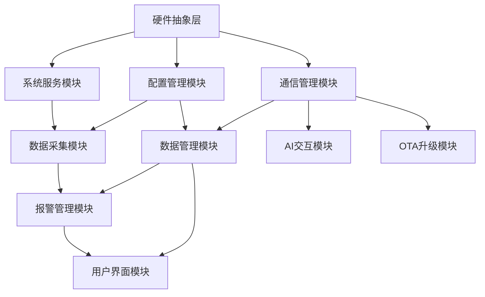

# 冷库 DTU 重构 - 模块设计文档集

## 📋 概述

本目录包含冷库 DTU 系统重构的详细模块设计文档。每个模块都有独立的设计文档，包含详细的功能需求、接口设计、实现方案和开发任务分解。

**项目特点**:

- 🎯 **目标明确**: 从轮询调度升级到 Zephyr RTOS
- 🏗️ **架构现代化**: 分层模块化设计，低耦合高内聚
- 📊 **任务精细化**: 每个任务都有明确的状态标识和完成标准
- 🔄 **进度可视化**: 实时进度跟踪和风险预警机制
- ✅ **质量保障**: 完善的测试和验收标准

---

## 📚 模块列表与状态

### 🔵 核心功能模块 (P1 优先级)

| 序号 | 模块名称                                              | 文档文件                            | 任务总数 | 完成状态  | 进度 | 负责人   | 风险等级 |
| ---- | ----------------------------------------------------- | ----------------------------------- | -------- | --------- | ---- | -------- | -------- |
| 01   | [数据采集模块](./01_SENSOR_MODULE.md)                 | `01_SENSOR_MODULE.md`               | 20       | ⚫ 未开始 | 0%   | 张工程师 | 🟢 低    |
| 02   | [通信管理模块](./02_COMMUNICATION_MODULE.md)          | `02_COMMUNICATION_MODULE.md`        | 22       | ⚫ 未开始 | 0%   | 李工程师 | 🟡 中    |
| 06   | [系统服务模块](./06_SYSTEM_SERVICES_MODULE.md)        | `06_SYSTEM_SERVICES_MODULE.md`      | 15       | ⚫ 未开始 | 0%   | 王工程师 | 🟢 低    |
| 07   | [硬件抽象层模块](./07_HARDWARE_ABSTRACTION_MODULE.md) | `07_HARDWARE_ABSTRACTION_MODULE.md` | 18       | ⚫ 未开始 | 0%   | 赵工程师 | 🟡 中    |
| 08   | [配置管理模块](./08_CONFIGURATION_MODULE.md)          | `08_CONFIGURATION_MODULE.md`        | 12       | ⚫ 未开始 | 0%   | 陈工程师 | 🟢 低    |

### 🟡 业务功能模块 (P2 优先级)

| 序号 | 模块名称                                       | 文档文件                       | 任务总数 | 完成状态  | 进度 | 负责人   | 风险等级 |
| ---- | ---------------------------------------------- | ------------------------------ | -------- | --------- | ---- | -------- | -------- |
| 03   | [数据管理模块](./03_DATA_MANAGEMENT_MODULE.md) | `03_DATA_MANAGEMENT_MODULE.md` | 25       | ⚫ 未开始 | 0%   | 刘工程师 | 🟢 低    |
| 04   | [报警管理模块](./04_ALARM_MODULE.md)           | `04_ALARM_MODULE.md`           | 18       | ⚫ 未开始 | 0%   | 孙工程师 | 🟢 低    |
| 05   | [用户界面模块](./05_USER_INTERFACE_MODULE.md)  | `05_USER_INTERFACE_MODULE.md`  | 20       | ⚫ 未开始 | 0%   | 周工程师 | 🟢 低    |

### 🟠 高级功能模块 (P3 优先级)

| 序号 | 模块名称                                     | 文档文件                      | 任务总数 | 完成状态  | 进度 | 负责人   | 风险等级 |
| ---- | -------------------------------------------- | ----------------------------- | -------- | --------- | ---- | -------- | -------- |
| 09   | [OTA 升级模块](./09_OTA_UPGRADE_MODULE.md)   | `09_OTA_UPGRADE_MODULE.md`    | 10       | ⚫ 未开始 | 0%   | 吴工程师 | 🟢 低    |
| 10   | [AI 交互模块](./10_AI_INTERACTION_MODULE.md) | `10_AI_INTERACTION_MODULE.md` | 12       | ⚫ 未开始 | 0%   | 郑工程师 | 🟢 低    |

### 🔧 系统支撑模块

| 序号 | 模块名称                                          | 文档文件                          | 任务总数 | 完成状态  | 进度 | 负责人     | 风险等级 |
| ---- | ------------------------------------------------- | --------------------------------- | -------- | --------- | ---- | ---------- | -------- |
| 11   | [任务跟踪系统](./11_TASK_TRACKING_SYSTEM.md)      | `11_TASK_TRACKING_SYSTEM.md`      | 8        | ⚫ 未开始 | 0%   | 项目经理   | 🟢 低    |
| 12   | [模块集成协调](./12_MODULE_INTEGRATION_DESIGN.md) | `12_MODULE_INTEGRATION_DESIGN.md` | 25       | ⚫ 未开始 | 0%   | 系统架构师 | 🟡 中    |

---

## 📊 项目总体进度统计

### 📈 总体数据 (截至 2024-12-XX 更新)

```
📊 项目概况
├─ 总模块数: 12 个
├─ 总任务数: 195 个
├─ 已完成: 0 个 (0.0%) 🟢
├─ 进行中: 0 个 (0.0%) 🟡
├─ 评审中: 0 个 (0.0%) 🔵
├─ 未开始: 195 个 (100.0%) ⚫
└─ 有问题: 0 个 (0.0%) 🔴

⏱️ 时间进度
├─ 项目启动: 2024-12-XX
├─ 当前阶段: 需求分析和设计
├─ 预计完成: 2025-08-01
└─ 剩余时间: 约 32 周

🎯 关键里程碑
├─ M1 - 设计完成: 2025-01-15 ⚫
├─ M2 - P1模块完成: 2025-04-01 ⚫
├─ M3 - P2模块完成: 2025-06-01 ⚫
└─ M4 - 系统验收: 2025-08-01 ⚫
```

### 📋 状态标识说明

| 标识 | 英文        | 中文含义 | 说明                           | 流转条件                 |
| ---- | ----------- | -------- | ------------------------------ | ------------------------ |
| ⚫   | NOT_STARTED | 未开始   | 任务尚未开始，等待前置条件满足 | 前置任务完成 → 🟡 进行中 |
| 🟡   | IN_PROGRESS | 进行中   | 任务正在进行，需要持续跟踪     | 开发完成 → 🔵 评审中     |
| 🔵   | IN_REVIEW   | 评审中   | 任务完成，等待代码评审和测试   | 评审通过 → 🟢 已完成     |
| 🟢   | COMPLETED   | 已完成   | 任务完成并通过验收             | 最终状态                 |
| 🔴   | BLOCKED     | 有问题   | 遇到阻塞问题，需要支持解决     | 问题解决 → 🟡 进行中     |

---

## 🏗️ 模块架构与依赖关系

### 📐 分层架构图

```
┌─────────────────────────────────────────────────────────┐
│                    应用层 (Application Layer)           │
├─────────────────────────────────────────────────────────┤
│   AI交互模块  │  用户界面模块  │  OTA升级模块          │
├─────────────────────────────────────────────────────────┤
│                    业务层 (Business Layer)              │
├─────────────────────────────────────────────────────────┤
│  数据采集模块  │  报警管理模块  │  数据管理模块         │
├─────────────────────────────────────────────────────────┤
│                    服务层 (Service Layer)               │
├─────────────────────────────────────────────────────────┤
│  通信管理模块  │  配置管理模块  │  系统服务模块         │
├─────────────────────────────────────────────────────────┤
│                    基础层 (Infrastructure Layer)        │
├─────────────────────────────────────────────────────────┤
│                  硬件抽象层模块                         │
├─────────────────────────────────────────────────────────┤
│                   Zephyr RTOS 内核                     │
├─────────────────────────────────────────────────────────┤
│                   硬件平台 (NANO100B)                   │
└─────────────────────────────────────────────────────────┘
```

### 🔗 关键依赖链



---

## 📋 文档结构标准

### 📄 每个模块文档包含以下标准章节

```
1. 模块概述
   ├─ 模块功能描述
   ├─ 在系统中的作用
   └─ 与其他模块的关系

2. 功能需求
   ├─ 详细功能列表
   ├─ 性能要求
   └─ 约束条件

3. 接口设计
   ├─ 公共 API 接口
   ├─ 数据结构定义
   └─ 回调函数定义

4. 架构设计
   ├─ 内部架构图
   ├─ 数据流设计
   └─ 状态机设计

5. 实现方案
   ├─ 技术选型
   ├─ 关键算法
   └─ 错误处理

6. 开发任务分解 ⭐
   ├─ 4阶段任务分解
   ├─ 状态标识跟踪
   ├─ 工期和依赖关系
   └─ 里程碑和交付标准

7. 测试计划
   ├─ 单元测试
   ├─ 集成测试
   └─ 性能测试

8. 风险控制
   ├─ 技术风险识别
   ├─ 应对措施
   └─ 风险监控

9. 交付标准
   ├─ 功能验收标准
   ├─ 性能验收标准
   └─ 质量验收标准
```

---

## 🚀 开发流程与计划

### 📅 分阶段开发策略

#### 🔵 阶段一: P1 模块开发 (12 周，2025.01-2025.03)

**核心基础模块，系统运行的根基**

```
Week 1-3: 基础架构
├─ 硬件抽象层模块 (3周)
├─ 系统服务模块 (2周)
└─ 配置管理模块 (2周)

Week 4-8: 核心功能
├─ 数据采集模块 (3周)
└─ 通信管理模块 (4周)

Week 9-12: 集成测试
├─ P1模块集成测试 (2周)
├─ 性能优化调试 (1周)
└─ 稳定性验证 (1周)
```

#### 🟡 阶段二: P2 模块开发 (8 周，2025.04-2025.05)

**业务功能模块，实现核心业务逻辑**

```
Week 1-4: 数据处理
├─ 数据管理模块 (3周)
└─ 报警管理模块 (2周)

Week 5-6: 用户交互
└─ 用户界面模块 (2周)

Week 7-8: 集成验证
├─ P2模块集成测试 (1周)
└─ 端到端功能测试 (1周)
```

#### 🟠 阶段三: P3 模块开发 (6 周，2025.06-2025.07)

**高级功能模块，增强系统能力**

```
Week 1-2: OTA升级模块 (2周)
Week 3-4: AI交互模块 (2周)
Week 5-6: 最终集成和优化 (2周)
```

### 🎯 关键里程碑检查点

| 里程碑                  | 时间节点   | 检查标准                          | 负责人     | 风险预案          |
| ----------------------- | ---------- | --------------------------------- | ---------- | ----------------- |
| **M1.1** - 基础架构完成 | 2025.02.01 | HAL+系统服务+配置模块集成测试通过 | 系统架构师 | 延期 1 周备用计划 |
| **M1.2** - 核心功能完成 | 2025.03.01 | 数据采集+通信模块功能测试通过     | 技术负责人 | 功能裁剪降级方案  |
| **M2.1** - 业务功能完成 | 2025.05.01 | 完整业务流程端到端测试通过        | 项目经理   | 性能指标调整      |
| **M3.1** - 系统集成完成 | 2025.07.01 | 全功能验收测试通过                | 质量经理   | 高级功能可选方案  |

---

## ⚠️ 风险管控

### 🔍 风险识别与等级

#### 🔴 高风险 (需要重点关注)

| 风险项                    | 影响模块 | 概率 | 影响度 | 应对策略              | 负责人     |
| ------------------------- | -------- | ---- | ------ | --------------------- | ---------- |
| Zephyr RTOS 学习曲线陡峭  | 所有模块 | 高   | 高     | 提前培训+技术支持     | 架构师     |
| 硬件资源限制(128KB Flash) | 所有模块 | 中   | 高     | 严格代码优化+功能裁剪 | 技术负责人 |
| 通信协议兼容性问题        | 通信模块 | 中   | 高     | 充分测试+备用方案     | 通信工程师 |

#### 🟡 中风险 (需要监控)

| 风险项           | 影响模块    | 概率 | 影响度 | 应对策略            | 负责人   |
| ---------------- | ----------- | ---- | ------ | ------------------- | -------- |
| 团队成员技能差异 | 所有模块    | 中   | 中     | 代码评审+结对编程   | 项目经理 |
| 集成测试复杂度高 | 集成模块    | 中   | 中     | 增量集成+自动化测试 | 测试经理 |
| 第三方组件依赖   | AI/OTA 模块 | 低   | 中     | 备选方案+自研备份   | 架构师   |

#### 🟢 低风险 (正常监控)

| 风险项         | 影响模块 | 概率 | 影响度 | 应对策略     | 负责人     |
| -------------- | -------- | ---- | ------ | ------------ | ---------- |
| 开发工具兼容性 | 所有模块 | 低   | 低     | 统一开发环境 | 工具管理员 |
| 文档维护滞后   | 文档管理 | 低   | 低     | 定期评审更新 | 技术文档员 |

### 🚨 风险预警机制

```markdown
### 预警级别定义

🟢 正常: 按计划进行，无明显风险
🟡 注意: 出现潜在风险，需要监控  
🔴 警告: 风险升级，需要立即行动

### 触发条件

- 🔴 任务延期超过 20%
- 🔴 连续 3 个任务状态为 🔴 有问题
- 🟡 模块完成率低于 50%且接近里程碑
- 🟡 团队成员请假超过 1 周

### 应对流程

1. 风险识别 → 2. 影响评估 → 3. 制定对策 → 4. 执行监控 → 5. 效果评估
```

---

## 📊 进度跟踪与报告

### 📈 每周进度报告模板

```markdown
## 📊 冷库 DTU 重构项目周报 (第 X 周)

### 基本信息

- **报告期**: 2024-12-XX ~ 2024-12-XX
- **报告人**: [项目经理姓名]
- **项目阶段**: [当前阶段]

### 📈 总体进度

- **完成任务**: X 个 (+Y 较上周)
- **完成率**: X% (+Y%较上周)
- **里程碑进度**: 距离下个里程碑 X 天

### 🎯 本周重点工作

- ✅ [已完成的重要工作 1]
- ✅ [已完成的重要工作 2]
- 🟡 [进行中的工作 1] (进度 X%)
- 🔴 [遇到问题的工作 1] (问题描述)

### 📋 模块进度详情

| 模块       | 计划任务 | 完成任务 | 完成率 | 状态 | 备注         |
| ---------- | -------- | -------- | ------ | ---- | ------------ |
| 硬件抽象层 | 5        | 3        | 60%    | 🟡   | 按计划进行   |
| 系统服务   | 3        | 1        | 33%    | 🟡   | 需要技术支持 |

### ⚠️ 风险与问题

- 🔴 **高**: [具体问题描述] - [负责人] - [预计解决时间]
- 🟡 **中**: [具体问题描述] - [负责人] - [当前状态]

### 📅 下周计划

1. [具体任务 1] - [负责人] - [预期完成时间]
2. [具体任务 2] - [负责人] - [预期完成时间]

### 🆘 需要支持

- [具体支持需求 1] - [紧急程度] - [申请原因]
- [具体支持需求 2] - [紧急程度] - [申请原因]
```

### 📱 日常跟踪机制

```markdown
### 每日站会 (Daily Standup) - 15 分钟

⏰ **时间**: 每工作日 9:00 AM
👥 **参与**: 所有开发人员 + 项目经理
📝 **格式**:

- 昨日完成了什么？
- 今日计划做什么？
- 遇到什么阻塞问题？

### 每周评审 (Weekly Review) - 1 小时

⏰ **时间**: 每周五 4:00 PM
👥 **参与**: 全项目组 + 技术负责人
📝 **内容**:

- 周报告回顾
- 风险问题讨论
- 下周计划确认
- 技术难点研讨

### 里程碑评审 (Milestone Review) - 2 小时

⏰ **时间**: 每个里程碑节点
👥 **参与**: 项目组 + 相关方代表
📝 **内容**:

- 里程碑交付验收
- 质量评估报告
- 下阶段计划调整
- 资源需求确认
```

---

## 🛠️ 开发工具与环境

### 💻 开发环境配置

```markdown
### 硬件环境

- **开发板**: Nuvoton NANO100B 开发板
- **调试器**: J-Link 或板载调试器
- **测试硬件**: 传感器模块、通信模块等

### 软件环境

- **操作系统**: Windows 10/11 或 Ubuntu 20.04+
- **IDE**: Visual Studio Code + PlatformIO
- **编译器**: GCC ARM Embedded
- **RTOS**: Zephyr RTOS v3.2.0+
- **版本控制**: Git + GitHub

### 开发工具链

- **代码编辑**: VS Code + C/C++ Extension
- **调试工具**: GDB + J-Link
- **静态分析**: Cppcheck, PC-lint
- **单元测试**: Unity Test Framework
- **文档工具**: Markdown + PlantUML

### 项目管理工具

- **任务跟踪**: GitHub Projects
- **文档管理**: GitHub Wiki
- **CI/CD**: GitHub Actions
- **沟通协作**: 微信群 + 腾讯会议
```

### 🔧 质量保证工具

```markdown
### 代码质量

- **编码规范**: MISRA C 2012 + 项目自定义规范
- **静态检查**: Cppcheck + PC-lint 集成到 CI
- **代码覆盖率**: gcov + lcov (目标>80%)
- **内存检查**: Valgrind(模拟器) + AddressSanitizer

### 测试工具

- **单元测试**: Unity + CMock
- **集成测试**: 自动化测试脚本
- **性能测试**: 内置性能监控模块
- **硬件在环**: 真实硬件自动化测试台

### 文档质量

- **文档规范**: Markdown 标准格式
- **图表工具**: PlantUML + Mermaid
- **评审机制**: Pull Request + Code Review
- **版本控制**: Git Tag + Release Notes
```

---

## 👥 团队组织与职责

### 🏢 组织架构

```
项目经理 (1人)
├── 系统架构师 (1人)
├── 技术负责人 (1人)
├── 开发团队 (6人)
│   ├── 高级工程师 (2人) - 负责P1关键模块
│   ├── 中级工程师 (3人) - 负责P2业务模块
│   └── 初级工程师 (1人) - 负责P3辅助模块
├── 测试工程师 (2人)
│   ├── 功能测试工程师 (1人)
│   └── 性能测试工程师 (1人)
└── 技术文档工程师 (1人)
```

### 📋 角色职责定义

| 角色           | 主要职责                         | 关键技能要求                  | 考核指标               |
| -------------- | -------------------------------- | ----------------------------- | ---------------------- |
| **项目经理**   | 项目整体管控、进度跟踪、风险管理 | 项目管理、沟通协调            | 项目按时交付、质量达标 |
| **系统架构师** | 架构设计、技术选型、方案评审     | 嵌入式架构、RTOS、设计模式    | 架构合理性、技术先进性 |
| **技术负责人** | 技术攻关、代码评审、团队指导     | 深度技术专家、团队管理        | 技术难题解决、团队成长 |
| **高级工程师** | 关键模块开发、技术方案制定       | 5 年+嵌入式经验、独立设计能力 | 模块质量、按时交付     |
| **中级工程师** | 业务模块开发、功能实现           | 3 年+开发经验、快速学习能力   | 代码质量、功能完整性   |
| **初级工程师** | 辅助功能开发、测试用例编写       | 1 年+经验、积极学习态度       | 任务完成度、技能提升   |
| **测试工程师** | 测试用例设计、质量保证           | 测试方法、自动化工具          | 缺陷发现率、测试覆盖率 |

---

## 📚 学习资源与培训

### 📖 技术学习路径

#### 🎯 Zephyr RTOS 学习 (2 周集中培训)

```markdown
Week 1: 基础概念
├─ Day 1-2: Zephyr 架构和概念
├─ Day 3-4: 设备树和配置系统  
└─ Day 5: 任务调度和同步原语

Week 2: 实践应用
├─ Day 1-2: 驱动开发框架
├─ Day 3-4: 网络和通信栈
└─ Day 5: 调试和性能优化
```

#### 📚 推荐学习资源

```markdown
### 官方文档

- [Zephyr Project Documentation](https://docs.zephyrproject.org/)
- [Zephyr Getting Started Guide](https://docs.zephyrproject.org/latest/getting_started/index.html)

### 在线课程

- [Zephyr RTOS Fundamentals](https://academy.nordicsemi.com/)
- [Embedded Linux and RTOS](https://www.coursera.org/specializations/embedded-systems)

### 书籍推荐

- 《Real-Time Systems Development with RTOS》
- 《Embedded C Programming Techniques》
- 《Software Architecture for Embedded Systems》

### 实践项目

- [Zephyr Samples](https://github.com/zephyrproject-rtos/zephyr/tree/main/samples)
- [Nordic nRF Connect SDK](https://github.com/nrfconnect/sdk-nrf)
```

### 🎓 技能培训计划

| 培训主题         | 目标人群     | 培训方式      | 时长   | 培训师     |
| ---------------- | ------------ | ------------- | ------ | ---------- |
| Zephyr RTOS 基础 | 全体开发人员 | 线下集中培训  | 2 周   | 外部专家   |
| 嵌入式系统设计   | 中高级工程师 | 在线学习+讨论 | 1 个月 | 架构师     |
| 代码质量与测试   | 全体工程师   | 内部分享      | 1 周   | 技术负责人 |
| 项目管理方法     | 项目骨干     | 外部培训      | 3 天   | 专业讲师   |

---

## 📞 联系信息与支持

### 👨‍💼 关键联系人

```markdown
### 项目管理层

- **项目经理**: 王经理

  - 📧 Email: wang.pm@company.com
  - 📱 电话: 138-0001-0001
  - 🏢 职责: 项目整体管控

- **技术负责人**: 李总工
  - 📧 Email: li.tech@company.com
  - 📱 电话: 138-0002-0002
  - 🏢 职责: 技术方案和攻关

### 开发团队核心

- **系统架构师**: 张架构

  - 📧 Email: zhang.arch@company.com
  - 🏢 职责: 系统架构设计

- **测试经理**: 赵测试
  - 📧 Email: zhao.qa@company.com
  - 🏢 职责: 质量保证和测试
```

### 🆘 技术支持渠道

```markdown
### 内部支持

- **技术讨论群**: 微信群"冷库 DTU 重构技术群"
- **问题跟踪**: GitHub Issues
- **知识库**: 项目 Wiki
- **代码评审**: GitHub Pull Request

### 外部支持

- **Zephyr 官方**: [Discord Community](https://discord.gg/hKAKT3s)
- **硬件厂商**: Nuvoton 技术支持 (service@nuvoton.com)
- **技术论坛**: [嵌入式开发者社区](https://www.embedded.com)
- **咨询服务**: 技术咨询公司 (根据需要)

### 紧急联系流程

1. **一般技术问题**: 群内讨论 → GitHub Issue
2. **阻塞性问题**: 直接联系技术负责人
3. **紧急事故**: 电话联系项目经理和技术负责人
4. **硬件故障**: 联系硬件工程师和供应商
```

---

## 📝 更新日志

| 版本   | 日期       | 更新内容                     | 更新人     |
| ------ | ---------- | ---------------------------- | ---------- |
| V1.0.0 | 2024-12-XX | 初始版本，模块设计文档集创建 | 系统架构师 |
| V1.1.0 | 2024-12-XX | 增加任务跟踪和进度管理机制   | 项目经理   |
| V1.2.0 | 2024-12-XX | 补充风险管控和团队组织结构   | 项目经理   |

---

## 🎯 使用指南

### 🚀 快速开始

```markdown
### 对于项目新成员

1. 📖 阅读本 README 了解项目全貌
2. 📚 根据角色查看对应的学习资源
3. 🛠️ 配置开发环境和工具
4. 📋 领取第一个开发任务
5. 👥 加入项目沟通群组

### 对于开发工程师

1. 📄 仔细阅读负责模块的设计文档
2. 🔍 理解模块接口和依赖关系
3. ✅ 按照任务分解开始开发
4. 📊 及时更新任务状态标识
5. 🔄 参与代码评审和测试

### 对于项目管理者

1. 📈 定期检查各模块进度状态
2. ⚠️ 监控风险预警和问题处理
3. 📅 组织里程碑评审和决策
4. 🤝 协调资源和解决阻塞问题
5. 📊 生成和发布进度报告
```

### 📋 文档维护规范

```markdown
### 更新频率

- **状态标识**: 每日更新 (开发人员)
- **进度统计**: 每周更新 (项目经理)
- **风险评估**: 双周更新 (风险管理员)
- **文档评审**: 每月评审 (技术负责人)

### 变更流程

1. 提出变更申请 (Issue 或 PR)
2. 技术评审和影响分析
3. 项目经理审批决定
4. 更新相关文档和代码
5. 通知所有相关人员

### 质量标准

- ✅ 所有链接有效可访问
- ✅ 表格数据准确完整
- ✅ 状态标识规范统一
- ✅ 格式符合 Markdown 规范
- ✅ 定期备份和版本控制
```

---

**📅 创建时间**: 2024 年 12 月  
**👨‍💼 文档负责人**: 项目经理 + 技术负责人  
**🔄 版本控制**: Git 版本控制，主分支保护  
**📈 下次重大更新**: 项目启动后每月更新

---

> 💡 **提示**: 本文档是项目的核心导航文档，建议加入浏览器书签便于快速访问。如有任何疑问或建议，请联系项目经理或在 GitHub 上提 Issue。
